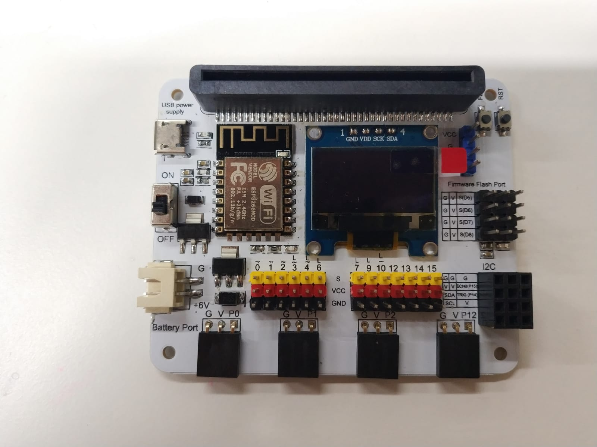

# Case 01: Automated Smart Playground Lamp

Level: 

## Part List: 
* LED Light X1
* Motion Sensor X1
* Connecting Wire X1
* micro:bit X1
* USB Cable X1

## Description: 
Motion sensor is used to detect if there are people moving in the playground, if there are, the LED light will be turned on; otherwise, it will be turned off.

## Coding:
Motion sensor keep checking the value of the motion sensor, if there are people moving (motion sensor value >=700), then the LED light will be turned on for 10 seconds.
 

## Hardware:
* Connect Motion sensor to P0
* Connect LED light to P1
* Download the code and transfer to micro:bit
* Plug the micro:bit into WiFi IoT extension board