# Case 01: Automated Smart Playground Lamp

Level: 

## Goal
Make a smart playground lamp by detecting the motion nearby.

## Background

## Part List: 
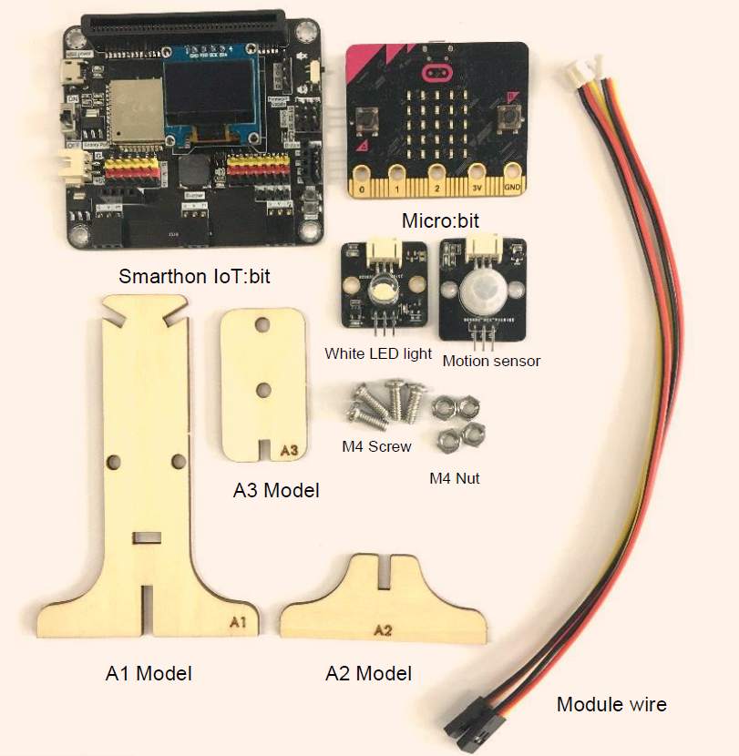
Electronics:
* micro:bit X1
* Smarthon IoT:bit X1
* USB Wire/Battery Holder X1
* White LED Light X1(With Module Wire)
* Motion Sensor X1 (With Module Wire)

Model:
* Playground Lamp Cardboard Model A1-A3 X1
* M4 Screw X2
* M4 Nuts X2

Equipment:
* ScrewDriver X1

## Practical Operation
1. Screw the sensor Attach the LED light to the model A3 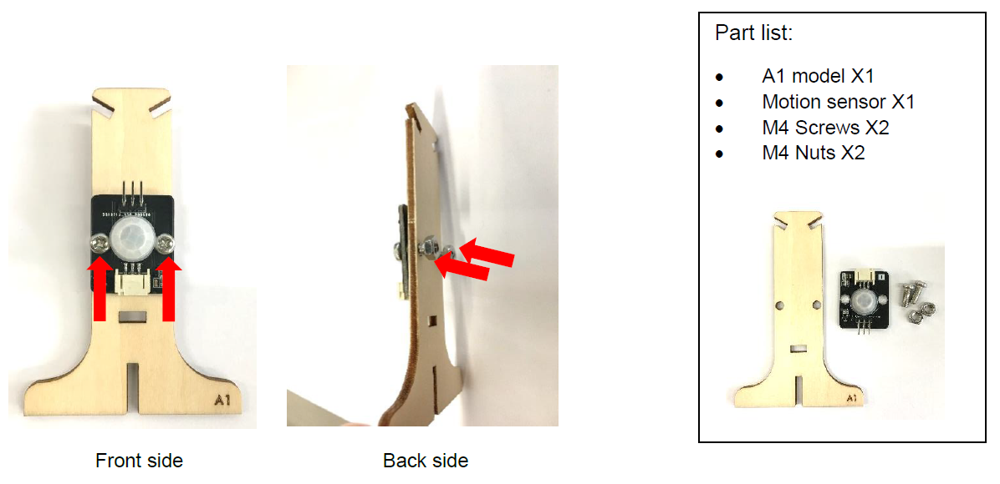
Attach the motion sensor to the model A1 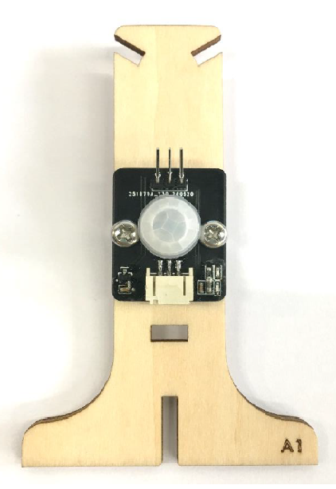 
2. Build the model Put together all the cardboard parts(A1-A3) 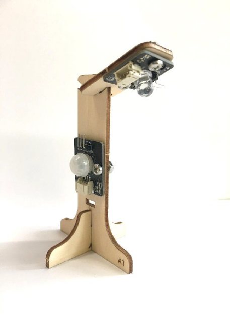

## Hardware connect

* Connect Motion sensor to the P0 port of Smarthon IoT:bit
* Connect LED light to the P1 port of Smarthon IoT:bit
 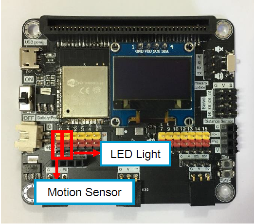
 Motion sensor: 
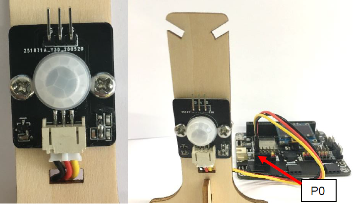
 LED light: 
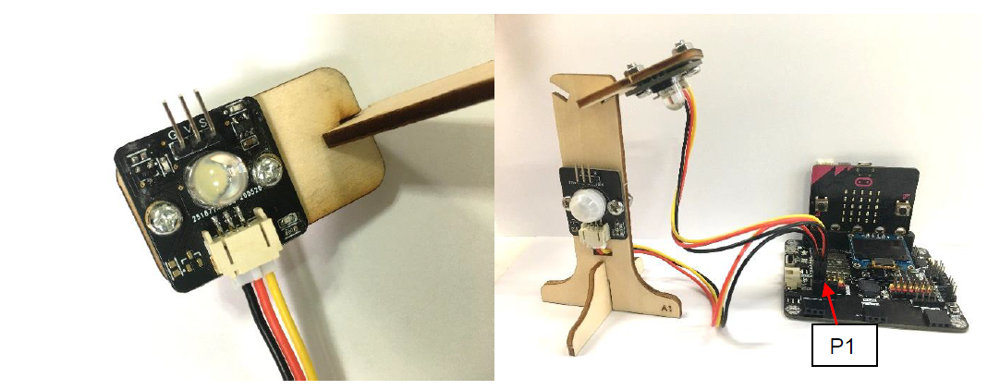

## Programming:
Step1. Drag forever block from Basic. Snap if statement into forever, set get motion (triggered or not) at P0=true, that's say motion is triggered, someone passes by. 

Step2. Turn white LED to 1023 at P1 as turning on white LED and pause 10 seconds.

Step3. Else, turn white LED to 0 at P1 as turing off white LED.
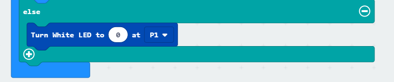

<iframe src="https://makecode.microbit.org/v2/#pub:_44zg2oKFRLhs" width="700" height="500" frameborder="0"></iframe>

## Result:
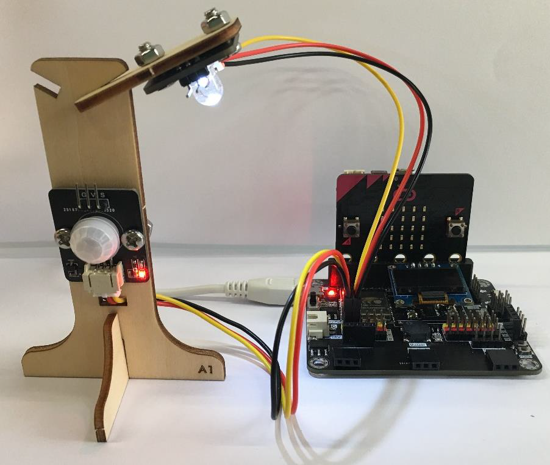
Motion sensor is used to detect if there are people moving in the playground. If there are, the LED light will be turned on; otherwise, it will be turned off.

## Think 
Q1. How can you use motion sensors, other than turning  on the light automatically? 
Q2. How should we reset the programming if we connect the white LED light to P3? 

Tips: We need to disable LED to use Pin P3.
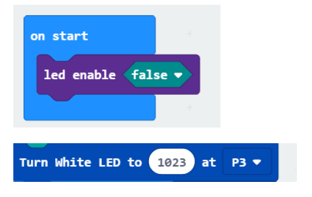
(Refer to [Micro:bit](https://makecode.microbit.org/device/pins))
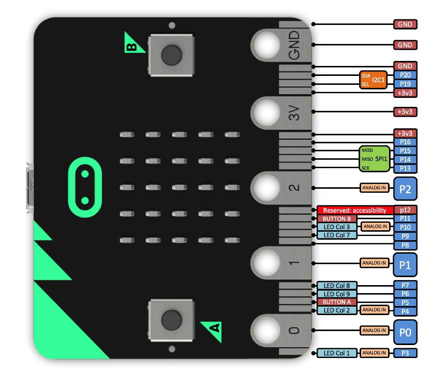
 Q3. Show motion sensor value on OLED
