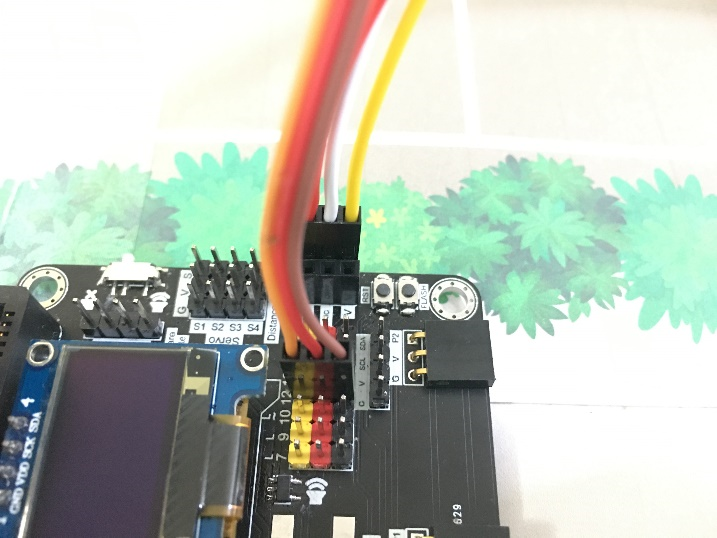

# Case 02: Smart Car park Access Barrier

Level: 

## Goal:
Make a smart car park gate which opens automatically if there are vacancies in the car park and there are cars near the car park gate.

## Background:

Smart Car park Access Barrier can reduce manpower to control the car park gate for the driver and count the number of cars in the car park. The auto-car park gate allows people to live conveniently.
 
 
<B>Car park gate operation</B> 
The car park gate should be able to open if there are vacancies in the car park (i.e. detected by light sensor) and there are cars near the car park gate (i.e. detected by distance sensor). It is controlled by the servo; otherwise, the gate will keep closing.

## Part List:

Electronics:
* micro:bit X1
* Smarthon IoT:bit X1
* OLED X1
* USB Wire/Battery Holder
* Light Sensor X1 (With Module wire)
* Distance Sensor X1 (With Module wire)
* 180° Servo X1

Model:
* Distance Sensor Stand Model D1-D3 X1
* M4 Screws X4
* M4 Nuts X4
* M2 Screw X2
* M2 Nuts X2

Equipment:
* ScrewDriver X1

## Practical operation
Screw the sensor (Paste photos here later)
* Attach the distance sensor to the stand model (D1)
* Screw the car park gate (D2) onto the stand model (D1)

Build the model 
* Put together all the cardboard parts D1-D3

## Hardware connect:

1. Connect Distance sensor to P14(Trig)/P15(Echo)

2. Connect Light Sensor to P0

3. Connect 180° Servo to P2

4. Download the code and transfer to micro:bit
5. Plug the micro:bit into WiFi IoT extension board

## Programming:
1. Drag on start block from Basic. Set distance and light to 0 from variables and turn servo to 0 degree at P2 at the beginning. 

2. Drag forever block from Basic. Set distance to get distance unit cm trig P14 echo P15.

3. Snap if statement into forever, set if distance ≤ 5 then, set light to get light value (percentage) at Pin P0.

4. Snap if statement after measuring the distance, if light > 50, turn servo to 90 degree at P2, pause 5 seconds and turn servo to 0 degree at P2.  That’s say when there is car entering and there is vacancy inside the car park, the car park gate will be opened for 5 seconds for car entering.

<iframe width="700" height="500" frameborder="0" src="https://makecode.microbit.org/v2/#pub:_bCf1XwDEP7dq"></iframe>

## Result
The light sensor is used to check the vacancies in the car park while the distance sensor is used to sense if there are any cars coming near the car park gate.  
The car park gate controlled by the servo will open when there are vacancies in the car park and there are cars near the car park gate.

## Think
Q1. When you find the light and distance value, how to show their value on the OLED?
  
Q2. Can you put some signal on micro:bit so that people know there is vacancy?
