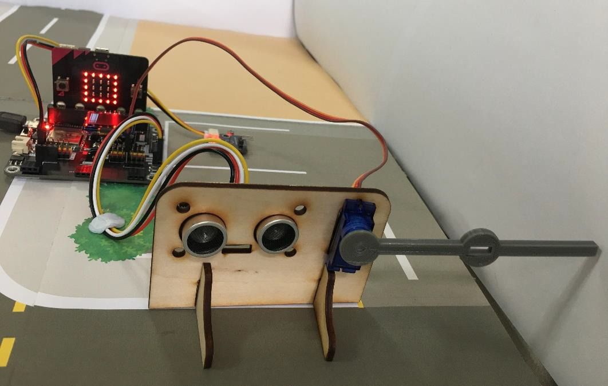
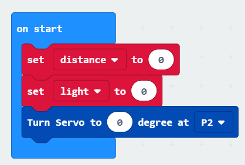

# Case 02: Smart Car park Access Barrier

Level: 
## Part List:
* OLED X1
* Light Sensor X1
* Distance Sensor X1
* 180° Servo X1
* Micro:bit X1
* Smarthon IoT:bit X1
* USB cable X1

## Description:
Light sensor is used to detect the vacancies in the car park. If there are any vacancies, the OLED will show to the people, and the gate will open by control the servo motor. Otherwise, the gate will keep closing.

## Coding:
Drag on start block from Basic. Set distance and light to 0 from variables and turn servo to 0 degree at P2 at the beginning. 

Drag forever block from Basic. Set distance to get distance unit cm trig P14 echo P15.

Snap if statement into forever, set if distance ≤ 5 then, set light to get light value (percentage) at Pin P0.

Snap if statement after measuring the distance, if light > 50, turn servo to 90 degree at P2, pause 5 seconds and turn servo to 0 degree at P2.  That’s say when there is car entering and there is vacancy inside the car park, the car park gate will be opened for 5 seconds for car entering.

## Hardware:
1. Connect Distance sensor to P14(Trig)/P15(Echo)
2. Connect Light Sensor to P0
3. Connect 180° Servo to P2
4. Download the code and transfer to micro:bit
5. Plug the micro:bit into WiFi IoT extension board
