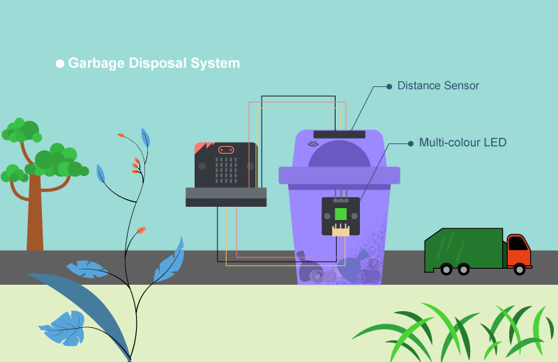
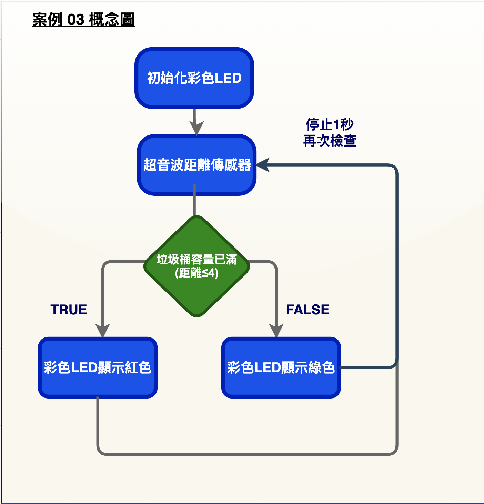
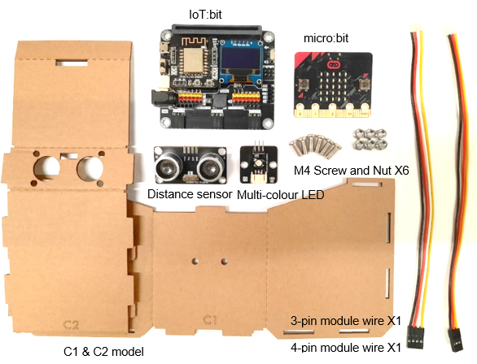
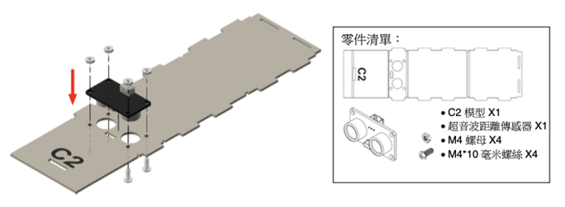
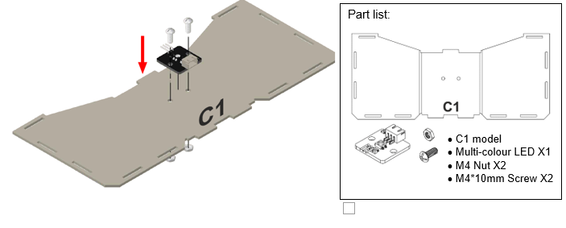
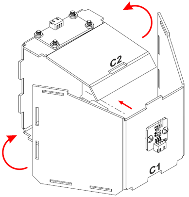
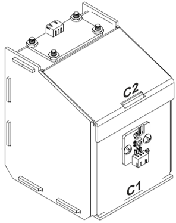
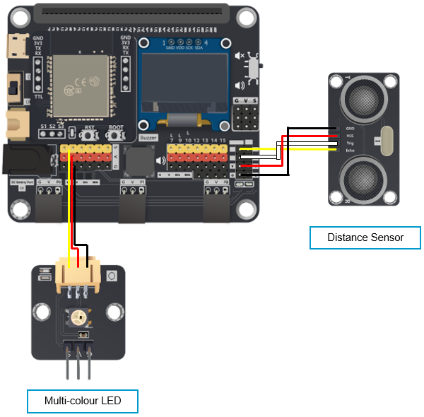
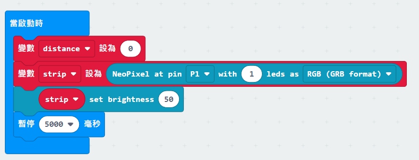

# 案例 03: 智能垃圾桶

程度: 

## 目標

製作一個會根據內部當前容量改變 LED 顏色的智能垃圾桶。 

## 背景

甚麼是智能垃圾桶?

垃圾桶上的 LED 可以告訴人們桶內的當前容量，收集工人可以輕易判斷有否需要清理垃圾。這樣可以減少更換垃圾袋的次數，從而減少膠袋用量。 

運作原理

距離傳感器可以探測桶內垃圾高度，從而轉化為當前容量。彩色 LED 則會隨著容量轉變。 

## 所用部件

## 組裝步驟

步驟一

用 M4\*10 毫米螺絲及螺母把超音波距離傳感器組裝到 C2 模型上。 

步驟二

用 M4\*10 毫米螺絲及螺母把彩色 LED 組裝到 C1 模型上。 

步驟三

組合 C1 和 C2 

步驟四

組裝完成! 

## 線路連接

* 連接超音波距離傳感器和 IoT:bit 的 P14(trig)/P15(echo)端口 

* 連接彩色 LED 和 IoT:bit 的 P1 端口 

## 編程 (MakeCode)

步驟一. 定義新變數和啟動彩色 LED 

* 定義新變數”distance”並設值為 0
* 在”Neopixel”模組中加入”變數 strip 設為 NeoPixel at pin P1 with 1 leds as RGB(BGB) format”至”當啟動時”
* 插入”strip set brightness 50”
* 插入”等待 5 秒”

步驟二. 讀取距離讀數

* 在「重復無限次」加入”變數 distance 設為取得量度距離使用單位厘米 trig 接口 P14echo 接口 P15”
* 加入”如果...那麼”，設”distance ≤ 4”為前提
* 加入”等待一秒鐘”

步驟三. 根據回報距離顯示相應距離

* 如果 distance ≤ 4， strip 會顯示紅色，否則綠色

完整答案 

MakeCode: [https://makecode.microbit.org/_Dxz8Yhge0eph](https://makecode.microbit.org/_Dxz8Yhge0eph) 

你可以在以下網頁下載HEX檔案: 
<iframe src="https://makecode.microbit.org/#pub:_Dxz8Yhge0eph" width="100%" height="500" frameborder="0"></iframe>

## 結果

距離傳感器會傳回桶內垃圾與垃圾桶頂部的距離。 LED 反映垃圾桶是否滿載。當滿載時，變為紅色，否則為綠色。 

## 思考

Q1. 如何加入音效提示滿載?(例如利用蜂鳴器) 

