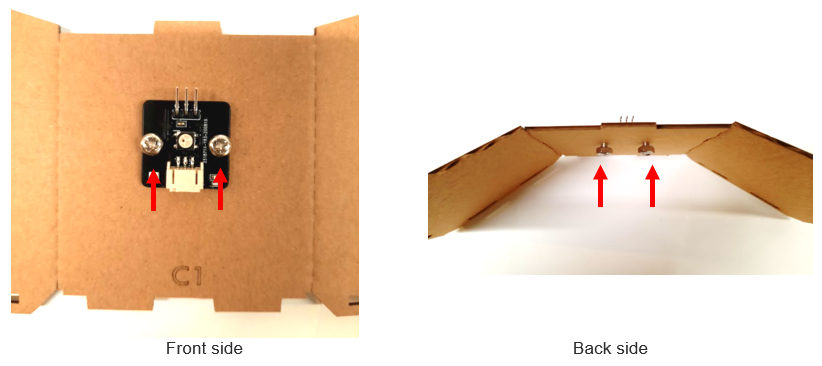
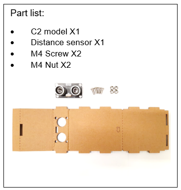
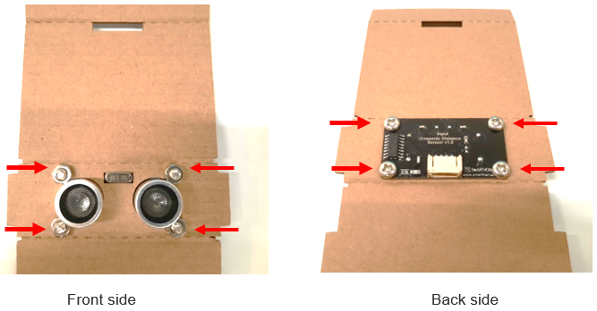
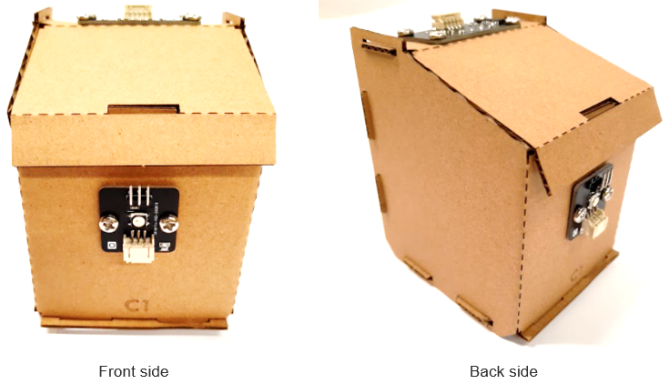

# Case 03: Garbage disposal system 

Level: 

## Goal

Make a smart garbage bin by showing different colors of light according to the volume of garbage inside. 

## Background

What is garbage disposal system?

LED light on the garbage bin can show people the amount of garbage inside the garbage bin so that garbage truck can easily determine if the garbage is full or not. This can minimize the wastage of the garbage bags and become a more environmental-friendly city. 

Garbage disposal system operation

The distance sensor should be able to sense the amount of garbage is inside the garbage bin. Multi-colour LED can be used to emit different colour of light (green and red light), which represent the emptiness of the garbage bin. 

## Part List

<table><tr><td>
Electronics:
<ul display='inline-block'>

<li>micro:bit X1</li>
<li>IoT:bit X1</li>
<li>USB Wire/Battery Holder</li>
&nbsp;&nbsp;1. Multi-colour LED (WS2812) X1 (with 3-pin module wire) 
&nbsp;&nbsp;2. Distance Sensor X1 (with 4-pin module wire) 
</ul>
</td></tr>
<tr>
<td>Model:
<ul>
<li>Garbage disposal Model C1-C2 X1</li>
<li>M4 Screw X6</li>
<li>M4 Nuts X6</li>
</ul>
</td></tr>
<tr><td>Equipment:
<ul><li>ScrewDriver X1</li></ul></td></tr></table>

## Practical operation

Step1

Attach the Multi-colour LED to C1 model with M4 screws and nuts. 

Step 2

Attach the distance sensor to C2 model with M4 screw and nuts. 

Step 3

Put together all the cardboard parts (C1-C2). 

## Hardware connect

Connect the Distance Sensor to P14 (trig)/ P15 (echo) port of IoT:bit 

Connect Multi-color LED to P1 port of IoT:bit 

## Programming (MakeCode)

Step 1

Drag on start block from Basic. Set distance to 0 and set strip to NeoPixel at pin P1 with 1 leds as RGB (GRB format). 

Step 2

strip set brightness to 50, pause for 5 seconds for initializing the multi-colour LED. 

Step 3

Drag forever block from Basic. Set distance to get distance unit cm trig P14 echo P15, that’s say get the distance value by connecting the distance sensor to P14 and P15. 

Step 4

Snap if statement into forever, set if distance ≤ 4, then strip show colour red, that’s say the garbage bin is full. 

Step 5

Else, strip show colour green, that’s say the garbage bin is not full. 

Step 6

Pause for 1 seconds from basic. 

## Result

The distance sensor can return the distance value between the top of the garbage bin and the level of garbage inside the garbage bin. The LED light is used to indicate if the bin is full or not. If it is empty or there are some garbage, the LED turns green, if it is full, the LED turns red. 

## Think

Q1. What other sensor can we use to measure the amount of garbage? 

