# 案例 05: 車速檢測器

程度: 
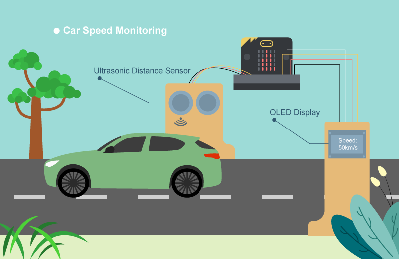

## 目標

製作一個車速檢測器。 

## 背景

甚麼是車速檢測器?

檢測系統能根據車輛在一定時間內移動距離得出其車速。 安裝檢測系統用以檢控有效減少交通意外發生。 

運作原理

超音波距離傳感器可以在兩個時間點測量車輛與其之間的距離，從而計算其速率。  

每 0.5 秒，傳感器會量度車輛與其之間距離。  

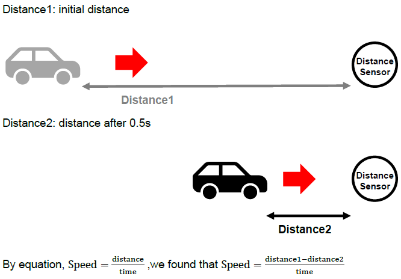

根據物理學，速率 = (距離一 – 距離二)， 這時候可得知有三種情況。 
* 距離一 > 距離二.. 車輛正靠近 
* 距離一 = 距離二.. 車輛已停止移動/路面沒有車輛 
* 距離一 < 距離二.. 車輛正轉向/駛離，此情況無視 
這速率可以在 micro:bit LED 以圖表表達車速.. 

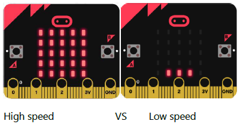

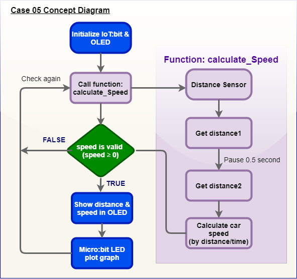

## 所用部件

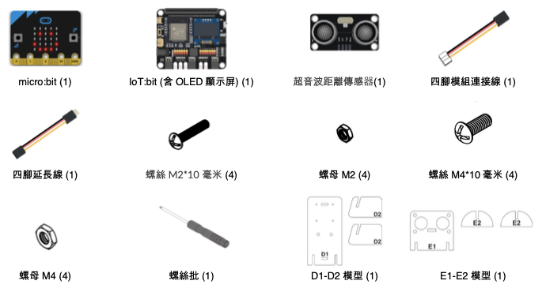

## 組裝步驟

步驟一

用 M2\*10 毫米螺絲及螺母把 OLED顯示屏 組裝到 D1 模型上。 

步驟二

組裝 D1 和 D2。 

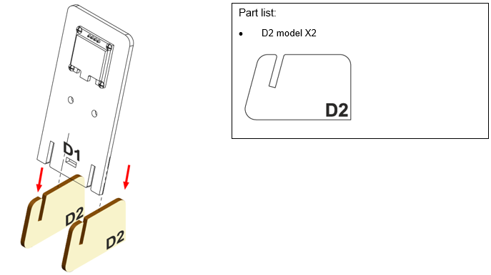

步驟三

底座組裝完成!
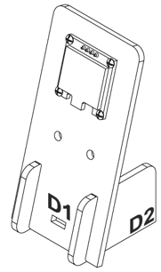

步驟四

用 M4\*10 螺絲及螺母把超音波距離傳感器組裝到 E1 模型。 

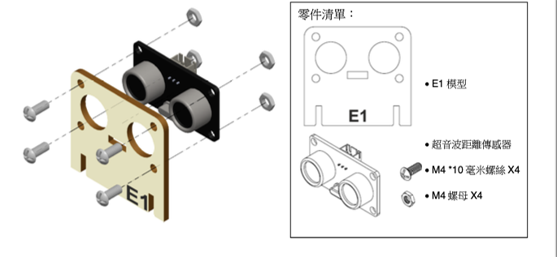

步驟五

組裝 E1 和 E2 模型。 

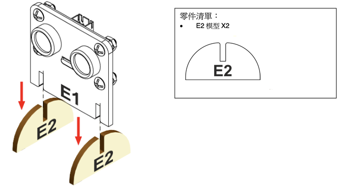

步驟六

組裝完成。! 

## 線路連接

* 連接超音波距離傳感器和 IoT:bit 的 P14(trig)/P15(echo)端口  

* 把 OLED 連到 IoT:bit 的 I2C 端口  

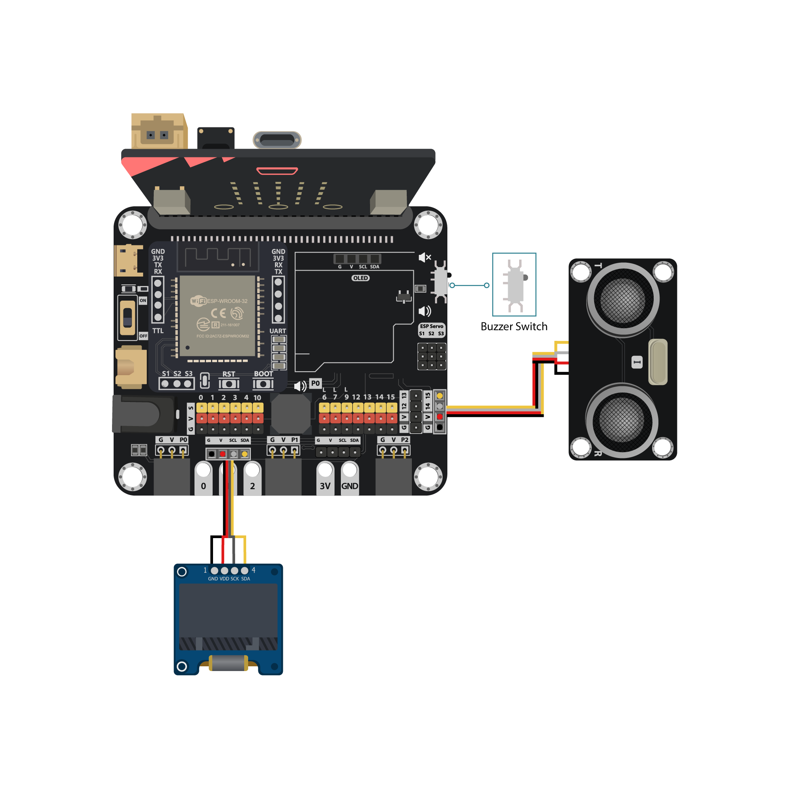

## 編程 (MakeCode)

步驟一. 啟動 OLED 顯示屏

* 初始化OLED顯示屏(128闊64高)
* 宣告新變數`distance1`，`distance2`，`speed`為0
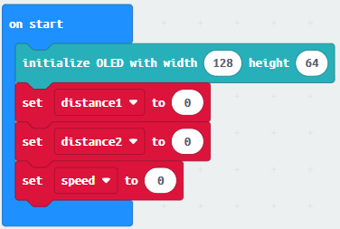

步驟二. 宣告函式(calculate_Speed)

* 在進階模塊「函式」宣告新函式 `calculate_Speed`
* 從`取得距離...`中取得數值，分別放入`distance1`和`distance2`
* 根據速率公式，設`speed` 為”(distane1 – distance2) / 0.5”
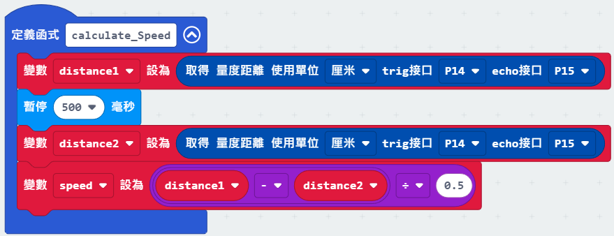

步驟三. 計算車速

* 在「重復無限次」叫喚`calculate_Speed`
* 加入”如果...那麼”，”speed ≥ 0”為前設
* 在邏輯中加入`點亮長條圖 顯示值為 speed 最大值為 20`
* 加入`清除顯示`，`新行顯示字符串(Distance1: distance1)，(Distance2: distance2)， (Speed: speed)`
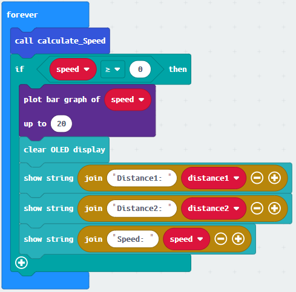

完整答案 

MakeCode: [https://makecode.microbit.org/_Ro5fAyhMdRvX](https://makecode.microbit.org/_Ro5fAyhMdRvX) 

你可以在以下網頁下載HEX檔案: 
<iframe src="https://makecode.microbit.org/#pub:_Ro5fAyhMdRvX" width="100%" height="500" frameborder="0"></iframe>

## 結果

超音波距離傳感器會持續監察車輛的距離。車速經計算後會顯示在 OLED 顯示屏，同時以圖表形式表現在 LED 上。 

## 思考

Q1. 如何設定音效提示以警示超速? 

