# 物聯網案例 06: 智慧天氣監測站

程度: 
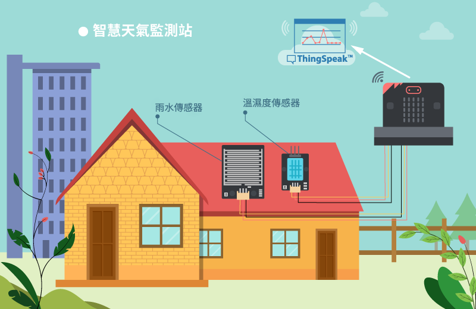

## 目標

製作一個能收集雨水，溫度及濕度傳感器數據的智慧天氣監測站，並自動把數據送上ThingSpeak 平台。 

## 背景

甚麼是 Thingspeak? 

ThingSpeak 是一個物聯網數據分析平台，提供即時數據圖表分顯然及分析。在這個案例，我們會使用該平台製作數據圖表。 

運作原理 

實時收集溫度、濕度和雨水數據並上傳至 ThingSpeak，令分析數據更輕鬆。 

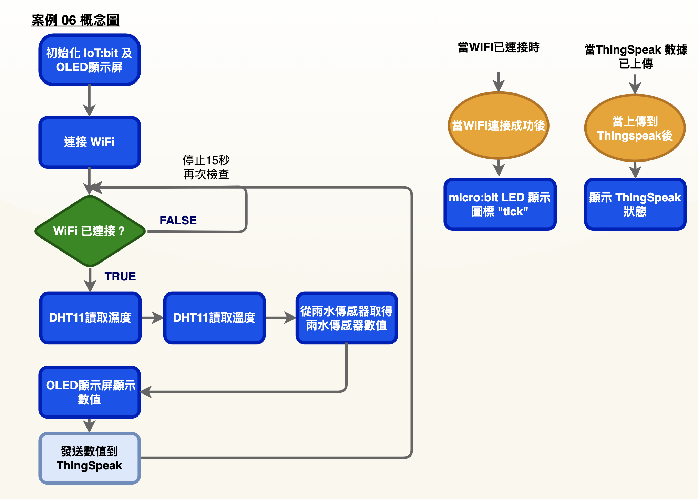

## 所用部件

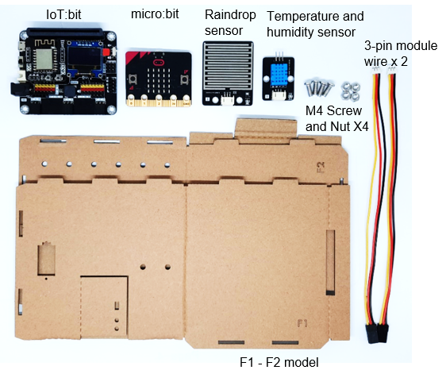

## 組裝步驟

 步驟一 

用M4\*10毫米螺絲及螺母把雨水傳感器組裝到 F2 模型上。 

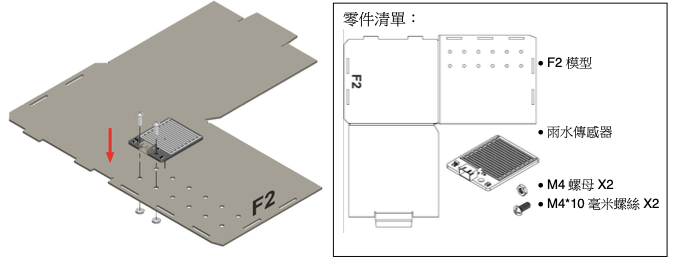

 步驟二 

用M4\*10毫米螺絲及螺母把溫度及濕度傳感器組裝到 F2 模型上。
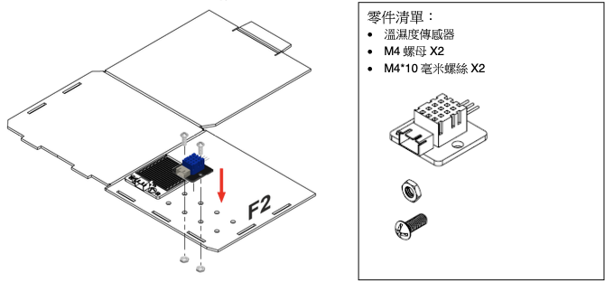

步驟三 

組裝 F1 和 F2 模型。
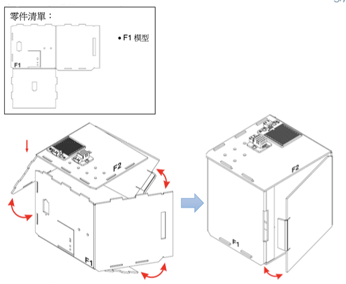

步驟四 

組裝完成!

## 線路連接

* 連接雨水傳感器和 IoT:bit 的 P0 端口 

* 連接溫度及濕度傳感器和 IoT:bit 的 P2 端口 

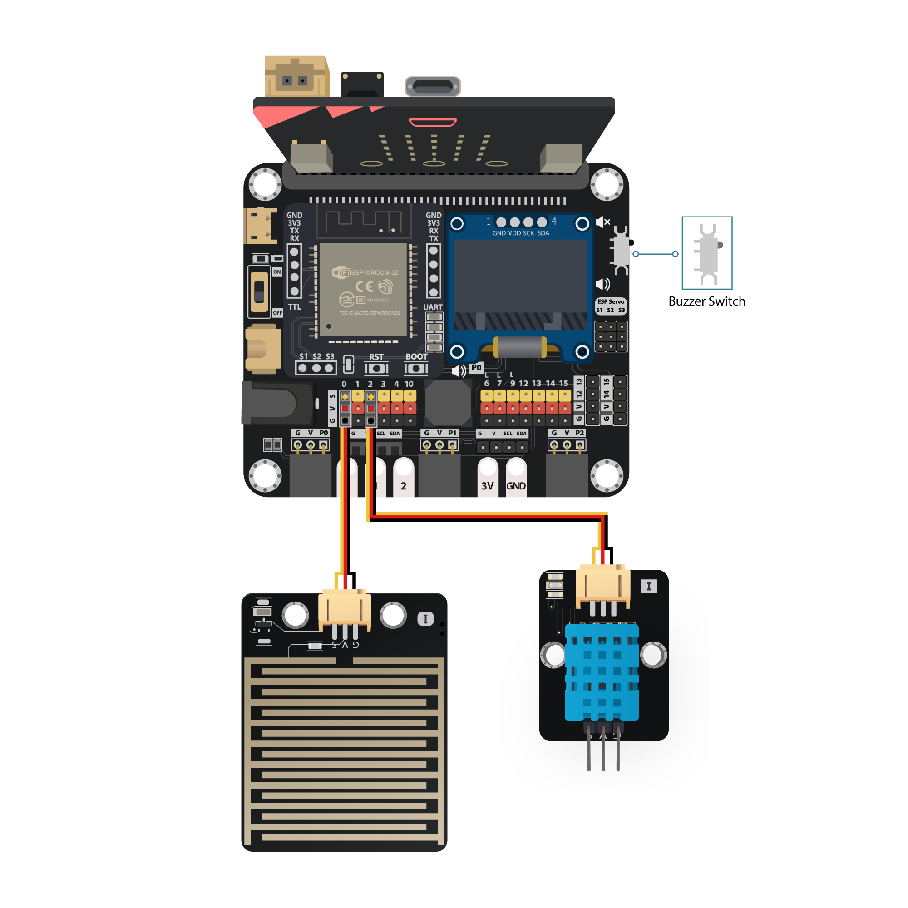

*注意

>1. 根據顏色連接接線和端口 
>2. P0 內建線路予蜂鳴器。在使用 P0 端口予其他外接設備時遇上問題，建議查看位於 IoT:bit 右上的蜂鳴器開關狀態

## IoT (ThingSpeak)

*詳細步驟參考* 附錄..上傳資料至 ThingSpeak” 

步驟一 

訪問 [https://thingspeak.com](https://thingspeak.com/)， 選擇 Channels -> My Channels -> New Channel 

  
步驟二 

輸入 `Channel name`， `Field1`， `Field2`，點擊 Save Channel 

* `Channel name`: Smart Weather Station
* `Field 1`: temperature
* `Field 2`: humidity
* `Freld 3`: raindrop

步驟三 

選擇 your channel >> API Keys，複製 API key 

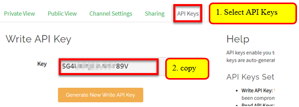

## 編程 (MakeCode)

步驟一. 啟動OLED，IoT:bit 和 Wi-Fi 

* 初始化OLED，IoT:bit 和 Wi-Fi
* 宣告新變數 `raindrop`，`humidity`，`temperature`並設值為0
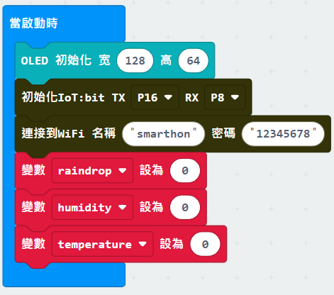

步驟二.連上網絡 

* 在連上網絡後於 OLED上顯示剔號
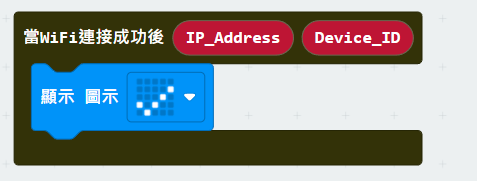

步驟三.讀取溫度、濕度和雨水讀數 

* 在「重復無限次」加入”如果...那麼”，`WiFi連接狀態`為前設
* 設`humidity`為`DHT11 讀取濕度接口 P2`
* 設`temperature`為`DHT11 讀取溫度接口 P2`
* 設`raindrop`為`取得雨水傳感器數值接口 P0`
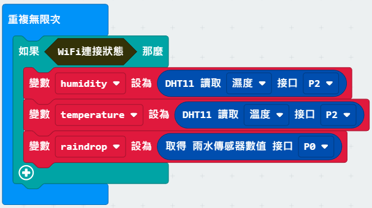

步驟四. 在 OLED 上顯示讀數 

* 加入”清除顯示”
* 新行顯示”Temperature: `temperature`， Humidity: `humidity`， Raindrop:
`raindrop`”
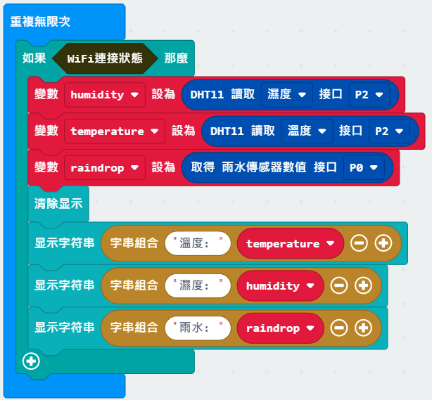

步驟五. 上傳資料至 ThingSpeak 

* 在”如果...那麼”加入”發送到ThingSpeak key...”及輸入API key
* 在 Field value 分別放入 `temperature`， `humidity`， `raindrop`
* 等待 15 秒
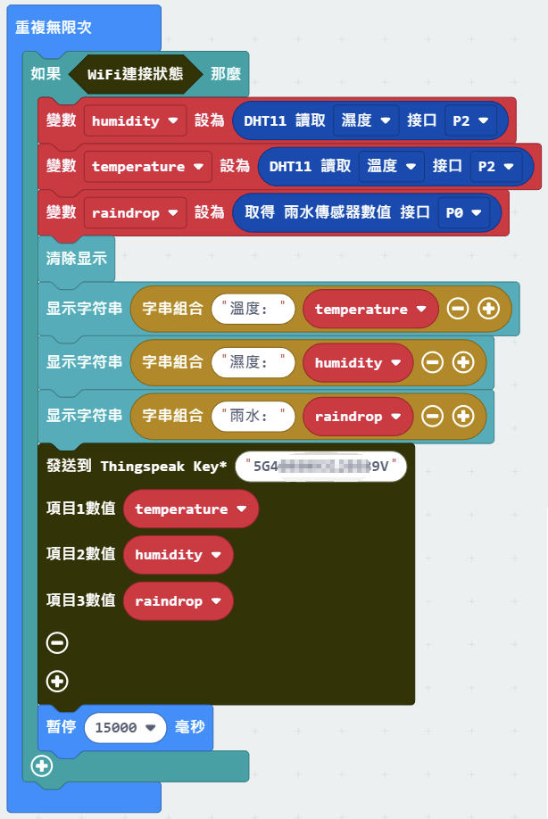

步驟六. 顯示上傳狀態 

* 加入`當上傳到Thingspeak後`
* 新行顯示”ThingSpeak: `Status`， Error: `Error_code`”
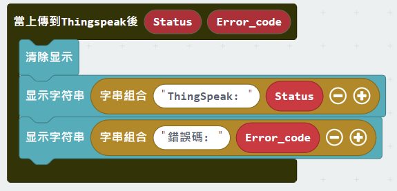

完整答案 

MakeCode: [https://makecode.microbit.org/_E2dUpj07a03j](https://makecode.microbit.org/_E2dUpj07a03j) 

你可以在以下網頁下載HEX檔案: 
<iframe src="https://makecode.microbit.org/#pub:_E2dUpj07a03j" width="100%" height="500" frameborder="0"></iframe>

## 結果

當 micro:bit 連到了互聯網，它會開始從傳感器讀取數據並上傳至 ThingSpeak。 

在 ThingSpeak 上設立的三個 fields 會反映實時數據。 

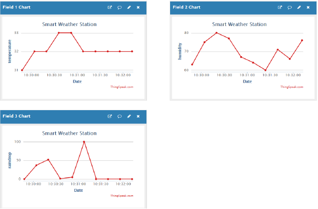

## 思考

Q1. 我們可以怎上傳其他種類的數據至 ThingSpeak? 

