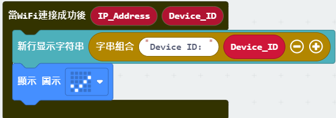
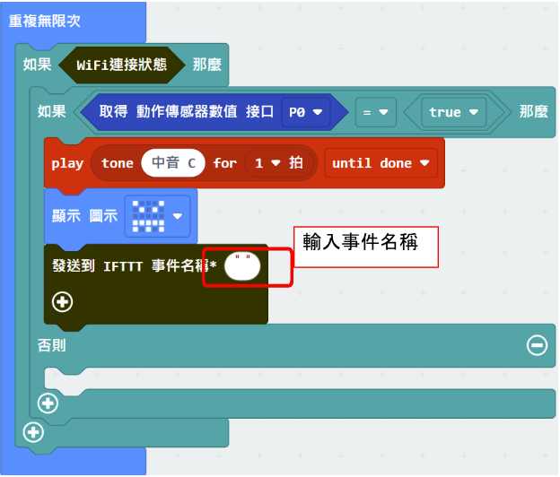
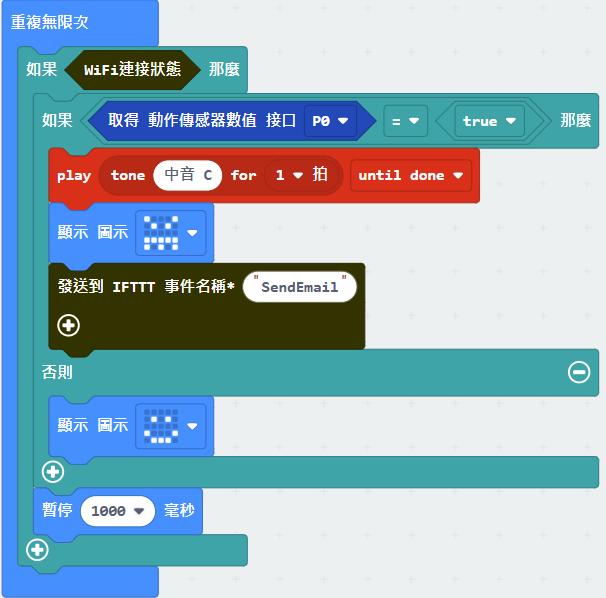
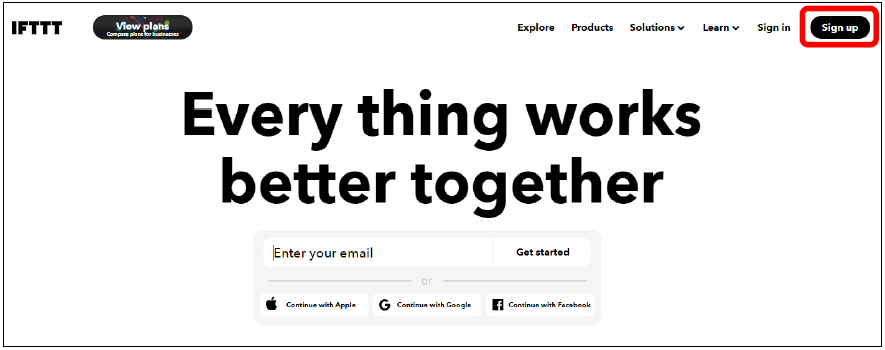
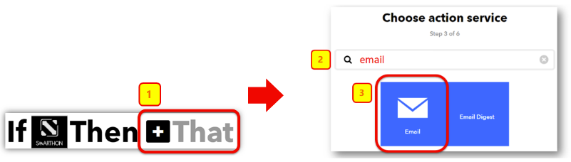

# 物聯網案例 07: 智能家居防盜系統

程度: 

## 目標

製作一個能在附近有可疑活動時自動發出警報和提示的智能家居防盜系統。 

## Background

甚麼是 IFTTT? 

IFTTT 可以把用家的應用程式和設備連接並容許它們進行交流以完成特定工作。 

運作原理 

運動傳感器回饋訊號至主板，若 TRUE 則主板激活蜂鳴器並自動發出電郵提示用家。
同時 OLED 顯示屏會反映有可疑人士。 

## 所用部件

## 組裝步驟

步驟一 

用M4\*10毫米螺絲及螺母把運動傳感器組裝至 F1 模型。

步驟二 

組裝 F1 和 F2 卡板。

步驟三 

組裝完成!

## 線路連接

* 連接運動傳感器和 IoT:bit 的 P1 端口 

* 檢查 IoT:bit 上的蜂鳴器開關 

 <B><I>請把蜂鳴器開關 "下拉" ，用以連接蜂鳴器</I></B>

## 編程(MakeCode)

步驟一. 啟動 OLED，Iot:bit 和連接至 Wi-Fi 

步驟二. 顯示剔號以表示連接至WiFi並顯示Device ID 

* 在放入一個「當WiFi連接成功後」
* 在裡面加入「新行顯示字符串」，放入字串組合並展示裝置ID
* 在裡面加入「顯示圖示勾號」，以在連線後顯示勾號

步驟三. 讀取運動傳感器讀數 

* 在「重復無限次」裏加入”如果...那麼”，以`WiFi connected?`為前設
* 在上述邏輯再加一個”如果...那麼”，以”取得運動傳感器數值接口 P1 = TRUE”為前設

 
步驟四. 當有人經過時自動發出警示 

* 在”如果...那麼”加入”演奏音階中音 C 持續 1 拍
* LED 顯示”Monster”圖示
* 加入”發送到 IFTTT事件名稱*...”

步驟五. 在無人經過時顯示”smile”圖示 

* 在”否則”加入”smile”圖示
* 在”WiFI connected?” 內加入等待 1 秒

完整答案 

MakeCode: [https://makecode.microbit.org/_3Vu4WV2Hf2wq](https://makecode.microbit.org/_3Vu4WV2Hf2wq) 

你可以在以下網頁下載HEX檔案: 
<iframe src="https://makecode.microbit.org/_3Vu4WV2Hf2wq" width="100%" height="500" frameborder="0"></iframe>

## IoT (IFTTT)

* *詳情參考* 附件..IFTTT 設定”  

第一步驟 

前往 [http://www.ifttt.com](http://www.ifttt.com)， 註冊一個帳號以登入 

第二步驟 

到右上角的菜單，點擊Create->Applet 

第三步驟 

* 選擇“This”
* 從選單中選擇“Smarthon IoT”。
* 輸入設備ID, 例如: 0x55a842e3477a (見編程部份第一步得到Device ID)
* 輸入事件名稱: SendEmail
* 點擊“Create trigger”按鈕。
  

 

第四步驟 

在That那裡選擇“email” 

 
第五步驟 

選擇“Send me an email” ，輸人電郵想要的標題及內容，點擊Create action. 

## 結果

當連上了 Wi-Fi，如果門旁邊有可疑活動，蜂鳴器會被激活並發出電郵，同時
micro:bit 上的 LED 會顯示”monster”圖示。 

## 思考

Q1. 如何避免短時間內重複發送了大量電郵?  

Q2. 能否加強辨認經過的人是否陌生人? 

