# 物聯網案例 07: 智能家居防盜系統

程度: 
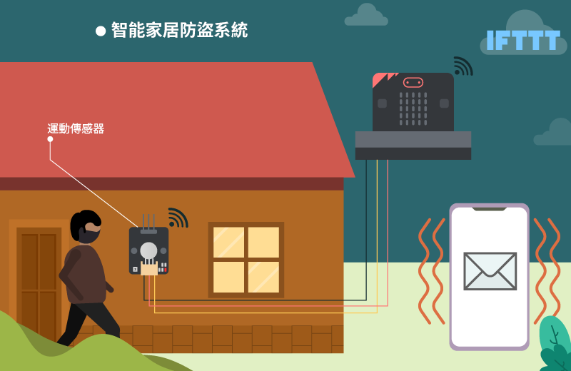

## 目標

製作一個能在附近有可疑活動時自動發出警報和提示的智能家居防盜系統。 

## Background

甚麼是 IFTTT? 

IFTTT 可以把用家的應用程式和設備連接並容許它們進行交流以完成特定工作。 

運作原理 

運動傳感器回饋訊號至主板，若 TRUE 則主板激活蜂鳴器並自動發出電郵提示用家。
同時 OLED 顯示屏會反映有可疑人士。 

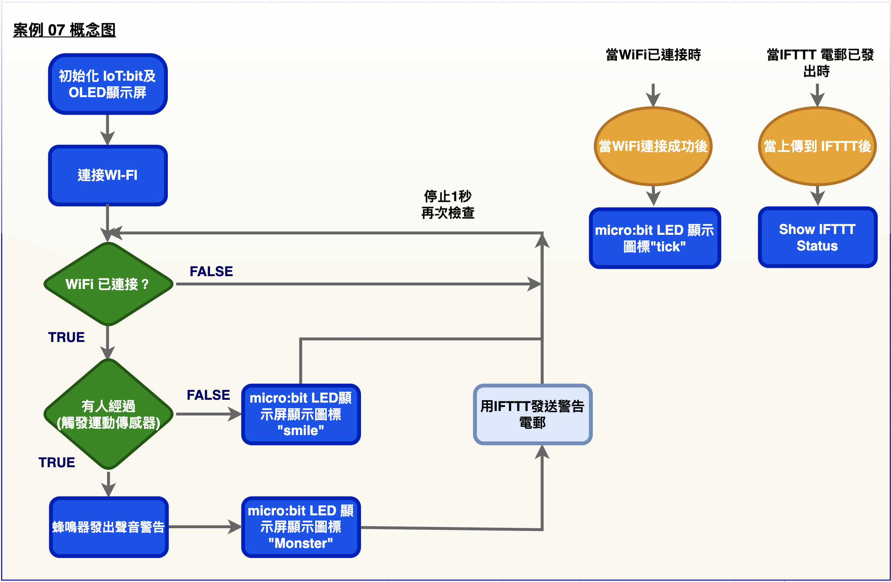

## 所用部件

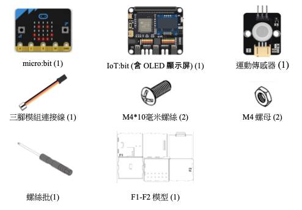

## 組裝步驟

步驟一 

用M4\*10毫米螺絲及螺母把運動傳感器組裝至 F1 模型。
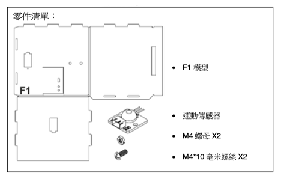

步驟二 

組裝 F1 和 F2 卡板。
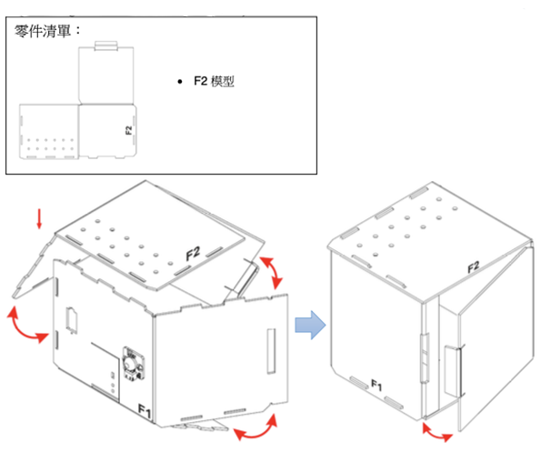

步驟三 

組裝完成!

## 線路連接

* 連接運動傳感器和 IoT:bit 的 P1 端口 

* 檢查 IoT:bit 上的蜂鳴器開關 

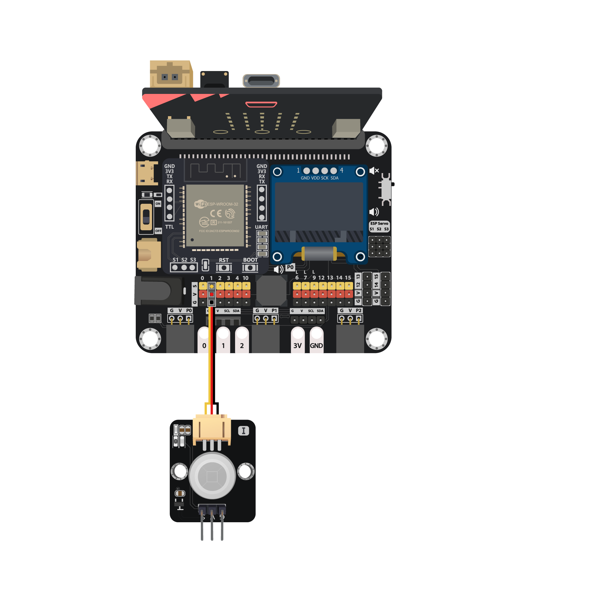

 <B><I>請把蜂鳴器開關 "下拉" ，用以連接蜂鳴器</I></B>

## IoT (IFTTT)

* *詳情參考* 附件..IFTTT 設定”  

步驟一 

訪問 [https://ifttt.com](https://ifttt.com/) ，創建新專案 (if webhooks then Email) 

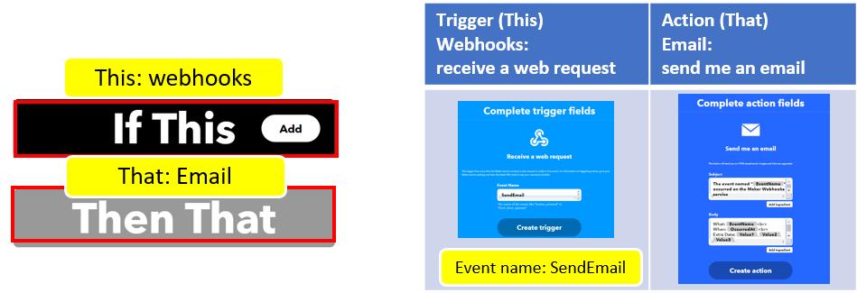

步驟二 

依次點擊“My services” >> “Webhooks”，select “Documentation” ，複製 Applet Key。 

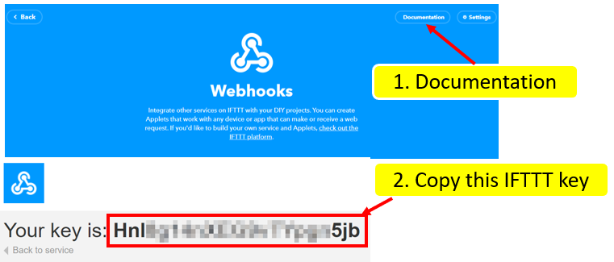

## 編程(MakeCode)

步驟一. 啟動 OLED，Iot:bit 和連接至 Wi-Fi 

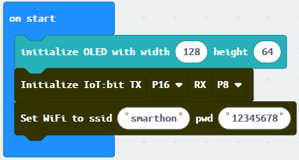

步驟二. 顯示剔號以表示連接至 Wi-Fi 

步驟三. 讀取運動傳感器讀數 

* 在「重復無限次」裏加入”如果...那麼”，以`WiFi connected?`為前設
* 在上述邏輯再加一個”如果...那麼”，以”取得運動傳感器數值接口 P1 = TRUE”為前設
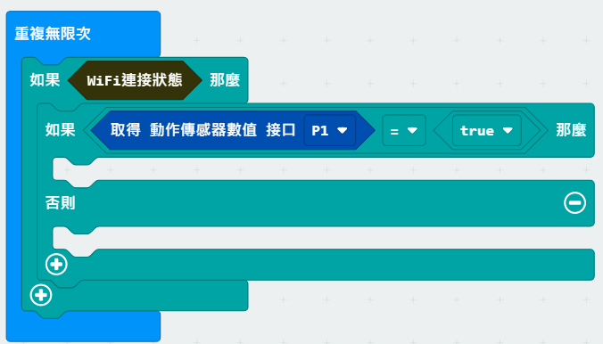

 
步驟四. 當有人經過時自動發出警示 

* 在”如果...那麼”加入”演奏音階中音 C 持續 1 拍
* LED 顯示”Monster”圖示
* 加入”Send IFTTT key... event_name...”
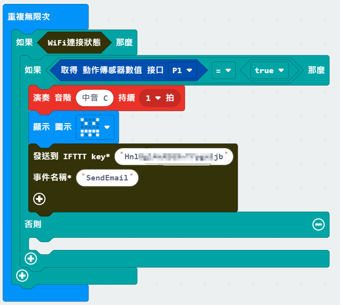

步驟五. 在無人經過時顯示”smile”圖示 

* 在”否則”加入”smile”圖示
* 在”WiFI connected?” 內加入等待 1 秒
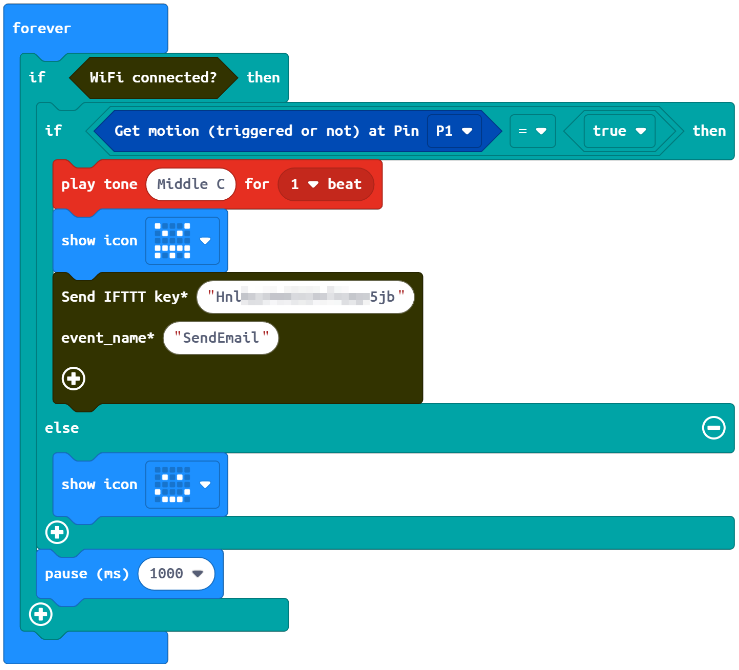

完整答案 

MakeCode: [https://makecode.microbit.org/_DyU6CsXYE7fx](https://makecode.microbit.org/_DyU6CsXYE7fx) 

你可以在以下網頁下載HEX檔案: 
<iframe src="https://makecode.microbit.org/#pub:_DyU6CsXYE7fx" width="100%" height="500" frameborder="0"></iframe>

## 結果

當連上了 Wi-Fi，如果門旁邊有可疑活動，蜂鳴器會被激活並發出電郵，同時
micro:bit 上的 LED 會顯示”monster”圖示。 

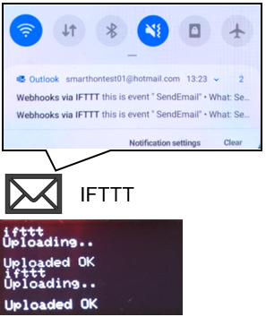

## 思考

Q1. 如何避免短時間內重複發送了大量電郵?  

Q2. 能否加強辨認經過的人是否陌生人? 

