# 物聯網案例 09: 遙距智能門控制

程度: 
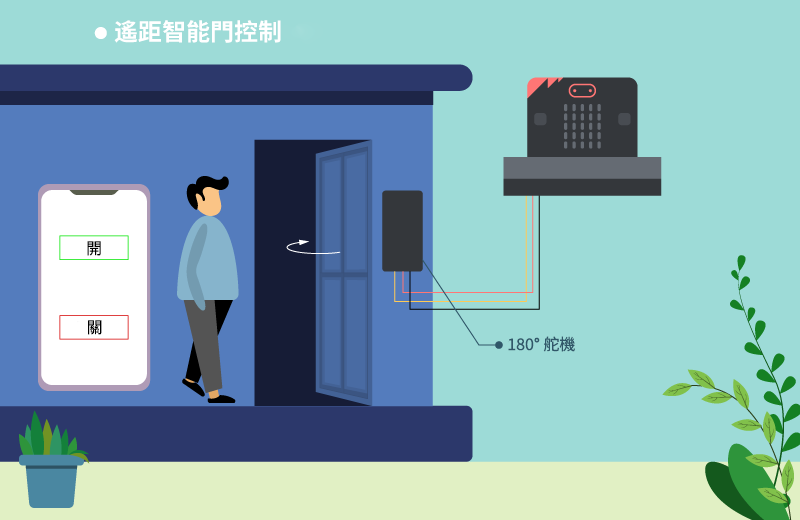

## 目標

用 App Inventor 製作一個能遙控開關門的應用程式。  

## 背景

甚麼是 app inventor? 

這是一個能讓用家自行開發智能電話程式的工具，Android及IOS都能夠使用。 

智能門控制原理 

當 microbit 收到”opendoor”訊號，舵機會自動轉動。當收到”closedoor”，門會自動關閉。 

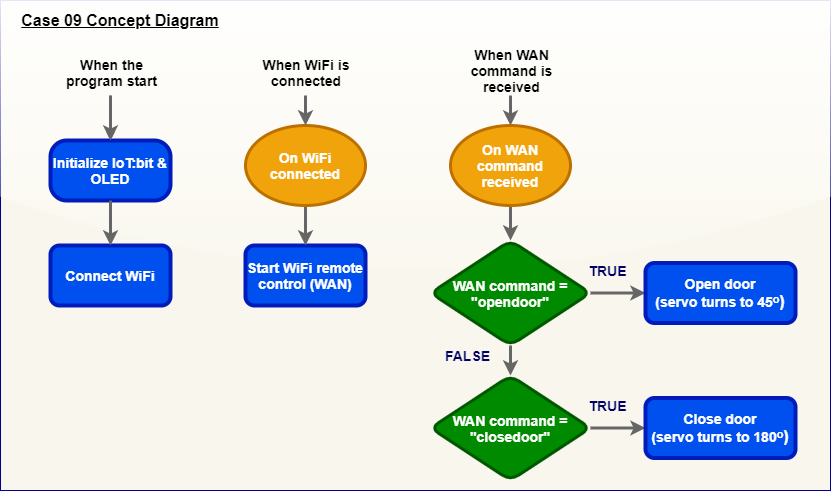

## 所用部件

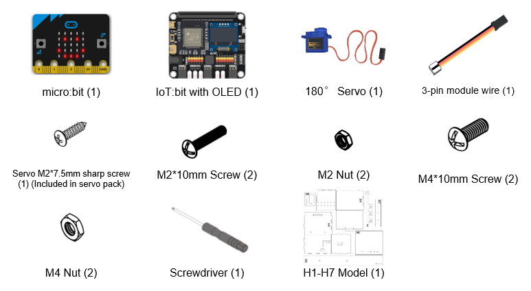

## 組裝步驟

步驟一 

用 M3 螺絲及螺母把 L字-模型組裝到 H1 模型上。 

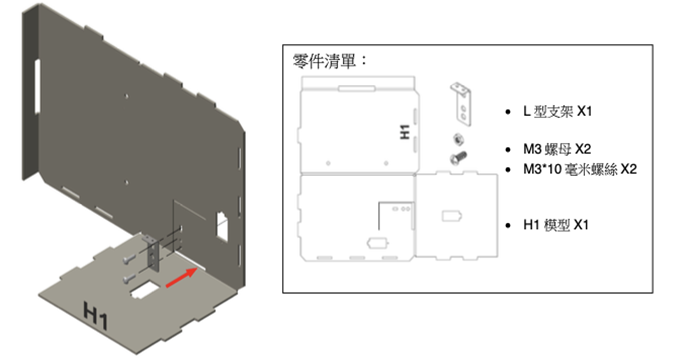

步驟二 

用M2\*7.5毫米螺絲把轉動臂固定在舵機,把 180ᵒ舵機組裝到 H1 模型。 

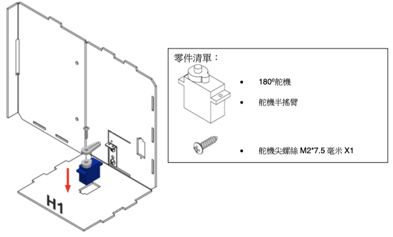

步驟三 

把萬字夾剪成長度 4.2 厘米，並連接及扣到 L字-模型。 

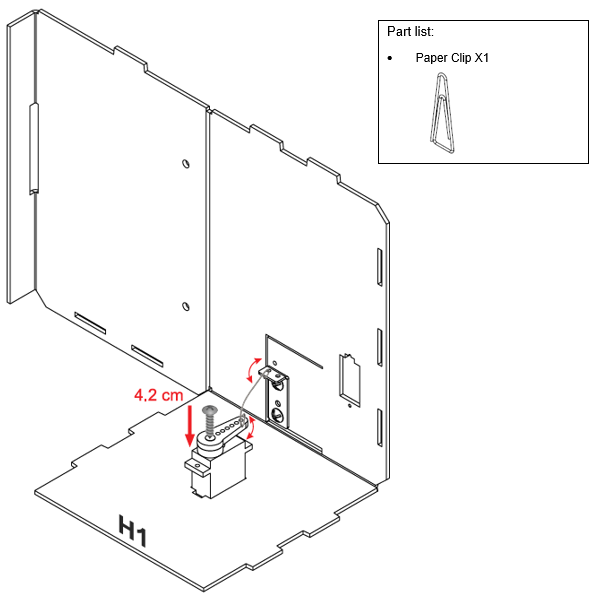

步驟四 

組裝所有模型。 

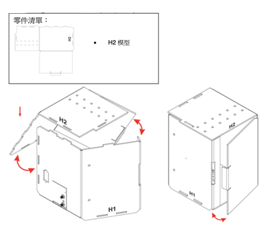

步驟五 

組裝完成! 

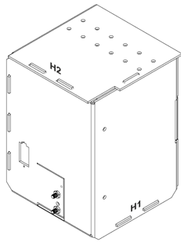

## 線路連接

連接 180ᵒ舵機和 IoT:bit 的 P2 端口 

Micro:bit P2|舵機
-:-|-:-
S (黃)|S (橙)
V (紅)|V (紅)
G (黑)|G (棕)

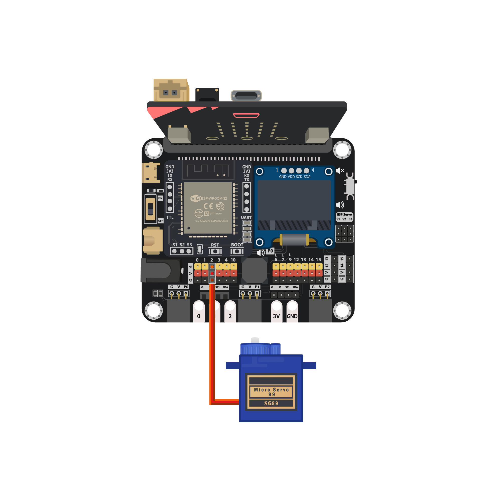

## 編程 (MakeCode)

步驟一. 啟動 OLED，Iot:bit 和連接至 Wi-Fi
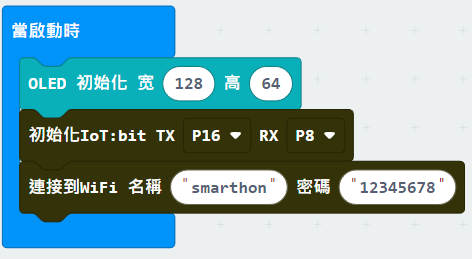

步驟二. 設定舵機初始位置 

* 加入`turn servo to 180 degree at P2`
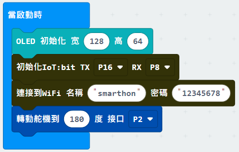

步驟三. 在連接至 Wi-Fi 後顯示剔號及ID 

步驟四. 接收 WAN 指令 

* 在`On WiFI received`加入清除顯示
* 新行顯示` "字串組合"Command” WAN_Command” `
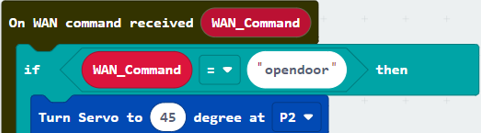

步驟五. 以 WAN 指令開關門 

* 如接收到”opendoor”，舵機轉向 45 度
* 如接收到”closedoor”，舵機轉向 180 度
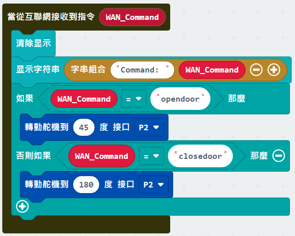

完整答案 

MakeCode: [https://makecode.microbit.org/_LtLRgxMVHMvc](https://makecode.microbit.org/_LtLRgxMVHMvc) 

你可以在以下網頁下載HEX檔案: 
<iframe src="https://makecode.microbit.org/#pub:_LtLRgxMVHMvc" width="100%" height="500" frameborder="0"></iframe>

 
## IoT (App Inventor)

*詳情參考”附錄..App Inventor 2* 

步驟一 

創建新頁面 

* On Designer:
* 在左邊界面拖出元素 
* 把”Web”拖到最下面
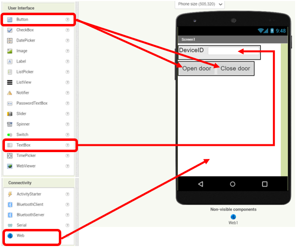

步驟二 

編程
* On Blocks: 
* The WAN control command URL is: 
[http://control.smarthon.cc/publish?id=DeviceID&msg=ControlCommand](http://control.smarthon.cc/publish?id=DeviceID&msg=ControlCommand)

* 當 button1 被點撃，以下指令會被執行
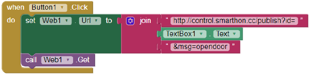

* 當 button2 被點撃，以下指令會被執行

* 下載程式至手機
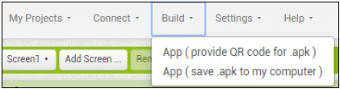

 
## 結果
在框內輸入 device ID，點選”opendoor”或”clodedoor” 

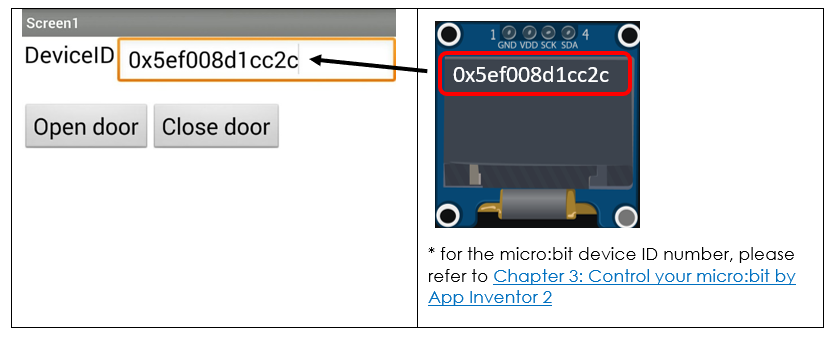

 

透過App Inventor，可以很輕易地控制門的開關 

## 思考

Q1. 能否增加密碼驗證才開門? 

Q2. 舵機還能在智能家居的什麼地方應用? 

