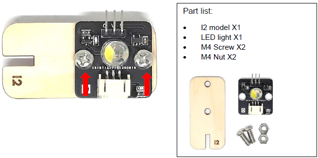
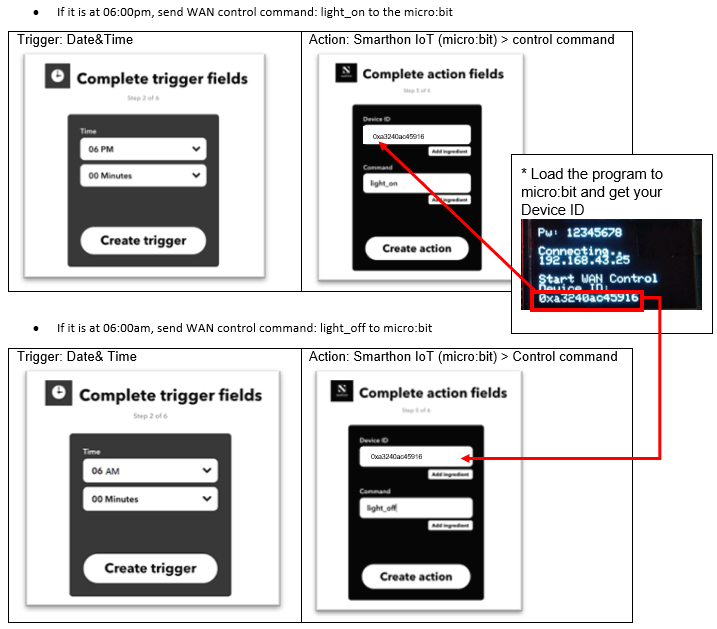
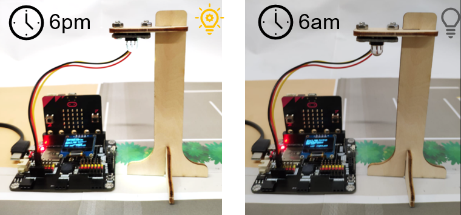

# IoT Case 10: Smart Street Light

Level: 

## Goal

Make a smart streetlight which can have a button to control on off. 

## Background

What is Smart Street Light? 

To make people living more conveniently, this light can be turned on and off with internal setting withing clicking buttons every day. 

Smart Streetlight operation 

When WAN commands are received from WAN (eg. IFTTT), micro:bit will get the command name. If the command name is “light_on”, the LED light will be turned on. If the command name is “light_off”, the LED light will be turned off. 

## Part List

<table><tr><td>
Electronics:
<ul display='inline-block'>
<li>micro:bit X1</li>
<li>IoT:bit(with OLED) X1</li>
<li>3-pin Module wire X1</li>
&nbsp;&nbsp;1. White LED Light X1 
</ul>
</td></tr>
<tr>
<td>Model:
<ul>
<li>Smart Street Light Model I1-I3 X1</li>
<li>M4 Screw X2</li>
<li>M4 nut X2</li>
</ul>
</td></tr>
<tr><td>Equipment:
<ul><li>ScrewDriver X1</li></ul></td></tr></table>

## Assembly step

Step 1 

Attach the LED light to the model I2 with M4 screw and nuts 

Step 2 

Put together all the cardboard parts (I1-I3) 

## Hardware connect

Connect the white LED Light to P1 port of IoT:bit 

## Programming (MakeCode)

Step 1 

Drag on start block from Basic. Drag Initialize IoT:bit at OLED from IoT:bit, set OLED height:64, width:128. Set WiFi to ssid “wifi_name” and pwd “WiFi_password”. 

Step 2 

Drag on WiFi connected and start WiFi remote control (WAN) from IoT:bit. 

Step 3 

Drag On WAN command received (WAN_command) from IoT:bit. 

Step 4 

Drag if statement into On WAN command received (WAN_command) from logic. Set if WAN_command = light_on then, turn white LED to 1023 at P1. 

Step 5 

Else if WAN_command = light_off then, turn white LED to 0 at P1. 

Full Solution 

MakeCode: [https://makecode.microbit.org/_cD9TLuDCEH7a](https://makecode.microbit.org/#pub:_cD9TLuDCEH7a) 

You could also download the program from the following website: 
<iframe src="https://makecode.microbit.org/#pub:_cD9TLuDCEH7a" width="100%" height="500" frameborder="0"></iframe>

## IoT (IFTTT)

* For the setting of IFTTT, please refer to “Chapter 4: Control your micro:bit by IFTTT Services” 

Step 1 

Create applet (If Date&time then Smarthon) 

## Result

The micro:bit is controlled by IFTTT (trigger by date&time). The LED light will be turned on at 6pm and turned off at 6am every day. 

## Think

Q1. How to turn on the light automatically if the today’s weather is cloudy reported by IFTTT.
