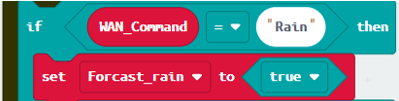
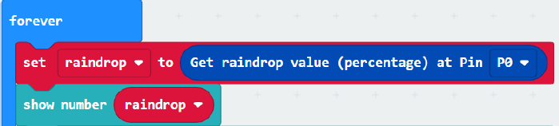

# IoT Case 11: Roof garden clothes rack

Level: 

## Goal

Make a smart roof garden clothes rack, once raindrop is detected, the rack can be opened automatically.

## Background

People no long need to rush up to the roof when raining as the clothes rack can be closed automatically even when house owner is not at home.
Smart roof garden operation
When raindrop sensor sensed that it is raining, it will send a signal to micro:bit and therefore the clothes rack will be opened. When there is no rain, the clothes rack will be closed.
Also, micro:bit can receive WAN commands from WAN (eg. IFTTT), the the micro:bit will get the command name. If the command name is “rain”, the servo will turn to 90ᵒ and the rack will be opened. If the command name is “clear”, servo will turn to 180ᵒ and the rack will be closed.

## Part List

 
## Assembly step

Step 1 

Step 1. Attach the raindrop sensor to the model H2 

Step 2 

Step 2. Attach the long stand (H3) to the model H1 

Step 3 

Step 3. Put together all the cardboard parts. 

Step 4 

Step 4. Screw the cloth rack (H5) onto the 180ᵒ servo using M2 screws   

Step 5 

Step 5. Put together the models H4-H5 and H6-H7.  

Step 6 

Step 6. Assembly completed! 

## Hardware connect

Connect the Raindrop sensor to P0 port of IoT:bit 

Connect the 180ᵒ Servo to P1 port of IoT:bit 

Micro:bit P1|Servo
:-: | :-: 
S (yellow) |S (orange)
V (red)	| V (red)
G (black) | G (brown)

## Programming (MakeCode)

Step 1 

Drag on start block fro Basic. Drag Initialize IoT:bit at OLED from IoT:bit, set OLED height:64, width:128. Set WiFi to ssid “wifi_name” and pwd “WiFi_password”. 

Step 2 

Set raindrop to 0. 

Step 3 

Set Forcast_rain to false. 

Step 4
span> 
Turn servo to 180 degree at P1 from Smartcity. The rack is closed. 

Step 5 

Drag On WiFi connected and start WiFi remote control (WAN) from IoT:bit. 

Step 6 

Drag on WAN command received (WAN_Command) from IoT:bit. 

Step 7 

If WAN_Command = clear then, set Forcast_rain to false. 

Step 8 

Else (i.e. WAN_Command ≠ clear, set Forcast_rain to true). 

Step 9 

Drag forever block from Basic. Set raindrop to get raindrop value (percentage) at Pin P0 and show number raindrop from OLED. 

Step 10 

Snap if statement into forever. Set if raindrop > 5 (raining) or Forcast_rain=true (it will rain) then. 

Snap turn Servo to 90 degree at P1 from Smartcity. That’s say the rack can be opened. 

Step 11 

Else, turn servo to 180 degree at P1. That’s say the rack will be closed otherwise. 

Step 12 

Pause for 15000ms. 

Full Solution 

MakeCode: [https://makecode.microbit.org/_UC24pMak66dT](https://makecode.microbit.org/#pub:_UC24pMak66dT) 

You could also download the program from the following website: 
<iframe src="https://makecode.microbit.org/#pub:_UC24pMak66dT" width="100%" height="500" frameborder="0"></iframe>

## IoT (IFTTT)

For the setting of IFTTT, please refer to “Chapter 4: Control your micro:bit by IFTTT Services” 

Step 1 

Create applet (If Weather Underground then Smarthon) 

If it is at 06:00pm, send WAN control command: light_on to the micro:bit 

## Result

The micro:bit is controlled by IFTTT (trigger by weather open data). When the weather condition change to “rain”, the cloth rack will be opened. When the weather condition change to “clear”, the cloth rack will be closed. 

## Think

Q1. How to notify the house owner the weather status (rain) by email through IFTTT? 

