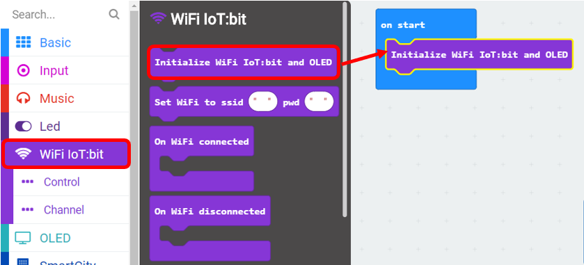
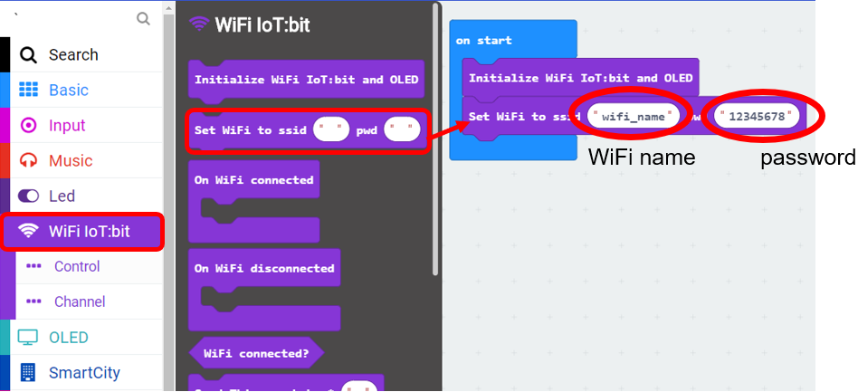
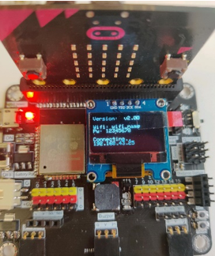
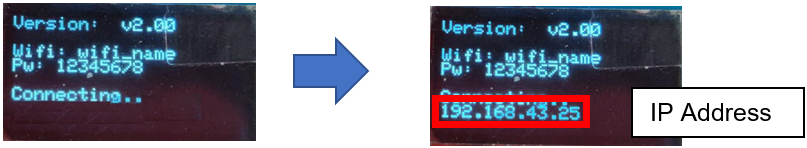
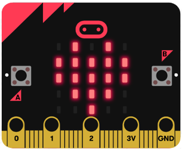

# Chapter 1: Connect micro:bit to the Wi-Fi

1. Before you start, you need to initialize the WiFi IoT:bit.
Choose WiFi IoT:bit -> Initialize WiFi IoT:bit and OLED

2. After initializing, you can connect to the WiFi:
Choose WiFi IoT:bit -> Set Wi-Fi to ssid “”, pwd “”. Enter your Wi-Fi name and password

3. “On WiFi connected” is an event handler, it will be triggered once after connected with WiFi.

4. Choose Basic -> show icon “heart” inside “On WiFi connected”

## Test it!
* Load the program to the micro:bit and connect the micro:bit to WiFi IoT:bit.

* Wi-Fi IoT:bit will start to connect to internet, when the connection is successful, the IP Address would be shown. 

* An icon “heart” will be shown on LED after WiFi is connected successfully.

