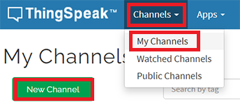
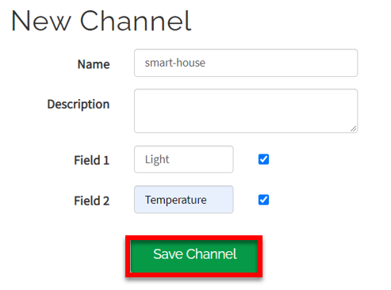
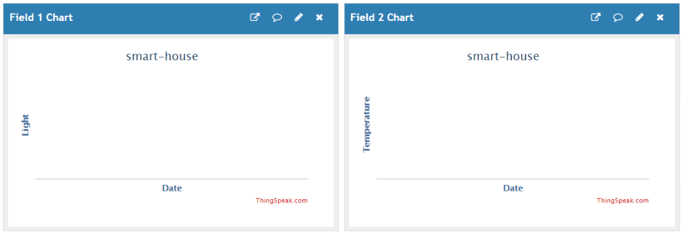
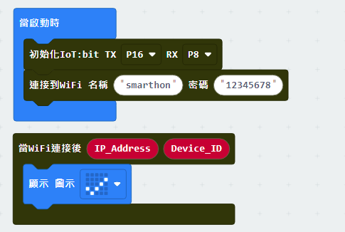
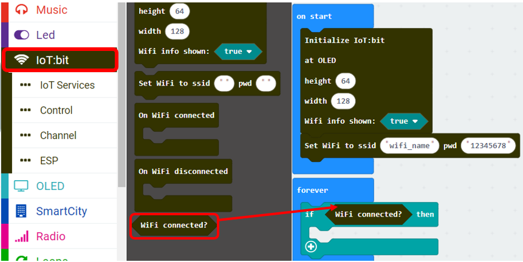
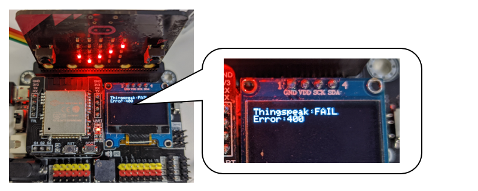
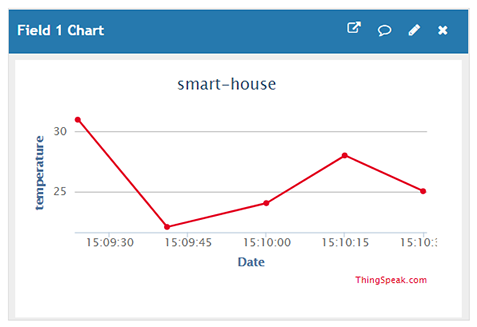

# Chapter 1: Upload Data to ThingSpeak

ThingSpeak is IoT platform for user to gather real-time data; for instance, climate information, location data and other device data. In different channels in ThingSpeak, you can summarize information and visualize data online in charts and analyze useful information.  ThingSpeak can integrate IoT:bit (micro:bit) and other software/ hardware platforms. Through IoT:bit, you can upload sensors data to ThingSpeak (e.g. temperature, humidity, light intensity, noise, motion, raindrop, distance and other device information). 

## Create channel in ThingSpeak and get the key

Step 1

Go to [https://thingspeak.com/](https://thingspeak.com/), register an account and login to the platform 

Step 2

Choose Channels -> My Channels -> New Channel 

Step 3

Input Channel name, Field1 and Field2 , then click “Save Channel” 

* Channel name: smart-house
* Field 1: Light
* Field 2: Temperature

Step 4

You will see two chats for data (field1, field 2) 

Step 5

Open your web browser, go to https://thingspeak.com , select your channel > “API Keys” ，copy the API key as follows: 

## Coding (Makecode)

Step 1

Before we do the thingspeak uploading part, we already know how to connect to the WiFi on the first chapter. 

Step 2

On every 15 seconds, if the WiFi is connected, it will send data to ThingSpeak. 

Step 3

If you want to show the thingspeak status, you can use the on Thingspeak Uploaded handler to get the variable for status and error code.  

Full Solution 

MakeCode: [https://makecode.microbit.org/_9PaTppdoCETi](https://makecode.microbit.org/#pub:_9PaTppdoCETi) 

You could also download the program from the following website: 
<iframe src="https://makecode.microbit.org/#pub:_9PaTppdoCETi" width="100%" height="500" frameborder="0"></iframe>

## Result

After Connected to Internet, the program start upload the data to Thingspeak.
 When the Upload is finish, it will shown the status OK and Error Code 0. 

If the thingspeak cannot be uploaded successfully, the status will return “FAIL” with error code.  For the error 400, the user inputted the wrong API Key. For the error code -28674, there is no internet connection.  

The charts in your channel in ThingSpeak will be updated.

