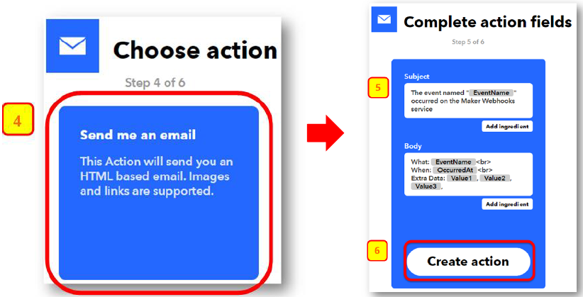
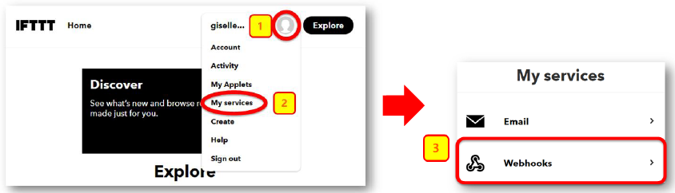
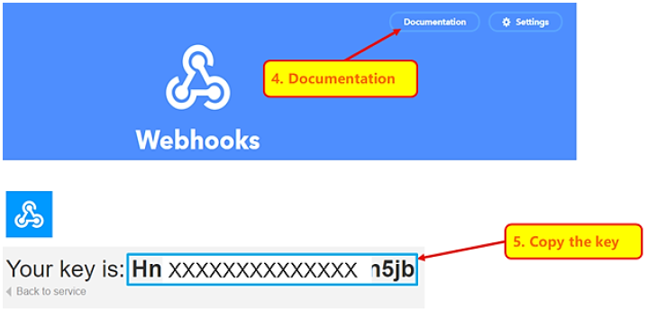
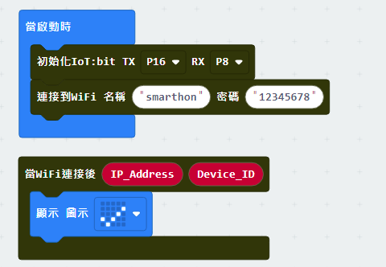
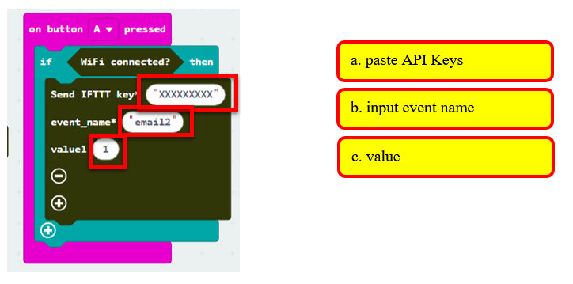
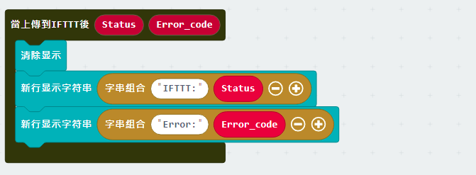
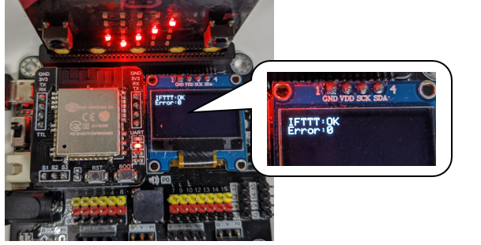
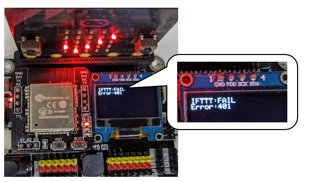

# Chapter 2: Send Email by IFTTT

IFTTT is the way to connect hundreds of the apps and devices, including Twitter, Dropbox, Email, Google Assistant, etc. By the basic programming logic "if this then that", it connects IoT services through their API (application programming interface).
 In IFTTT, you can make your own applet and link services together by "if this(trigger) then that(action)". For example, if we select webhooks (micro:bit button A) as trigger, Email (send email to your mailbox) as action. When micro:bit button A is pressed, it triggers (webhooks) and implement the action (send email) in IFTTT. 

In this chapter, you will learn using micro:bit to activate trigger (webhooks). After that, it can implement other services (e.g. email) 

## IFTTT Configuration

<H3>Goal:</H3>
Create applet and get the API key

Step 1 

Go to [http://www.ifttt.com](http://www.ifttt.com), register an account and login to the platform 

Step 2 

On the top right menu, click “Create” > “Applets” 

Step 3 

Select this -> select webhooks -> input Event Name (eg. Event Name: SendEmail)，then click “Create trigger”  

Step 4 

Select “That” > Email 

Step 5 

Select “Send me an email” , Input email title and body, then click “Create action”  

Step 6 

Open your web browser, open the top right menu, select “My services” > “Webhooks”  

Step 7 

Select “Documentation” ，Copy your Webhooks Key as follows: 

## Coding (Makecode)

Step 1 

Before we do the IFTTT uploading part, we have already know how to connect to the WiFi on the first chapter.  

Step 2 

When need to send ITFFF request, if `WiFi connected`, send data to IFTTT. 
Input the following data of the IFTTT Application to the `Send IFTTT key…` block
 

* `IFTTT API key`: XXXXXXXXXXXXXXXX. 
* `event_name`: event name to trigger in Webhooks (eg. SendEmail)
* `value 1-3`: if user want to add the value inside the email, click the add button and input value1, value2, value3

Step 3 

If you want to show the IFTTT upload status, you can use the “on IFTTT Uploaded” handler to check the variable. You may use the OLED to display the status and error code. 

* Go to OLED Tab
* Snap `initialize OLED with width…height..` to `on start`
* Snap the `show string` inside the `On IFTTT Uploaded`
* Draw the variable from `On IFTTT Uploaded` to the `show string` block placeholder

Full Solution 

MakeCode: [https://makecode.microbit.org/_Txv1LF34edWu](https://makecode.microbit.org/#pub:_Txv1LF34edWu) 

You could also download the program from the following website: 
<iframe src="https://makecode.microbit.org/#pub:_Txv1LF34edWu" width="100%" height="500" frameborder="0"></iframe>

## Result

After micro:bit is connected to WiFi and click button A, it will upload data to IFTTT. 

If the upload is success, it will show `OK` with error code `0`

If the upload is fail (such input wrong API key in this case), it will show `FAIL` with `error code`. 
For the error 401, the user inputted the wrong API Key. For the error code -28674, there is no internet connection.

When success, email will be sent to your mailbox by IFTTT. 

