# Chapter 2: Upload Data to ThingSpeak

ThingSpeak is a great platform for user to uploading data for IOT. It allows you to create channel for uploading data. You can visualize the information in charts, for data visualization.
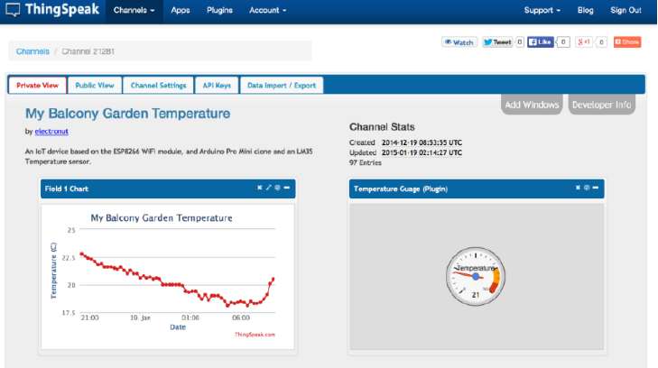
 

## Create channel in ThingSpeak
Step 1
* Go to https://thingspeak.com/, register an account and login to the platform

Step 2
* Choose Channels -> My Channels -> New Channel
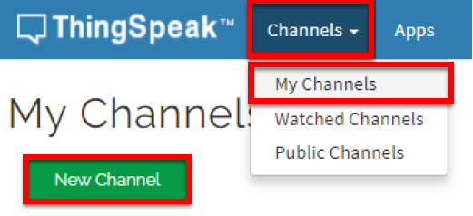

Step 3
* Input Channel name, Field1 and Field2 , then click “Save Channel”
> * Channel name: smart-house
> * Field 1: Light
> * Field 2: Temperature
> 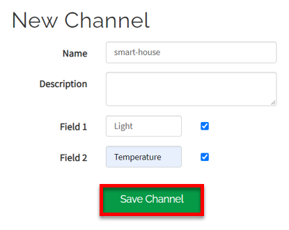

Step 4
* You will see two chats for data (field1, field 2)
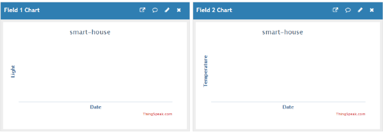

Step 5
* Open your web browser, go to https://thingspeak.com , select your channel > “API Keys” ，copy the API key as follows:
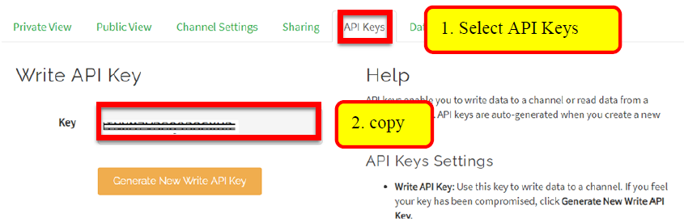

## Programming (Makecode)
Step 1
* if WiFi is connected, it returns true, otherwise it returns false.
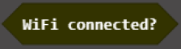

Step 2
* It will send data (field1, field2, field3) to Thingspeak with the key provided
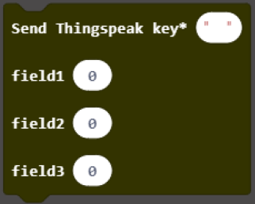

Step 3
* Select “WiFi IoT:bit” > “Initialize WiFi Iot:bit and OLED” and “Set WiFi to ssid…pwd”. 
* On every 15seconds, if the WiFi is connected, it will send data to ThingSpeak.
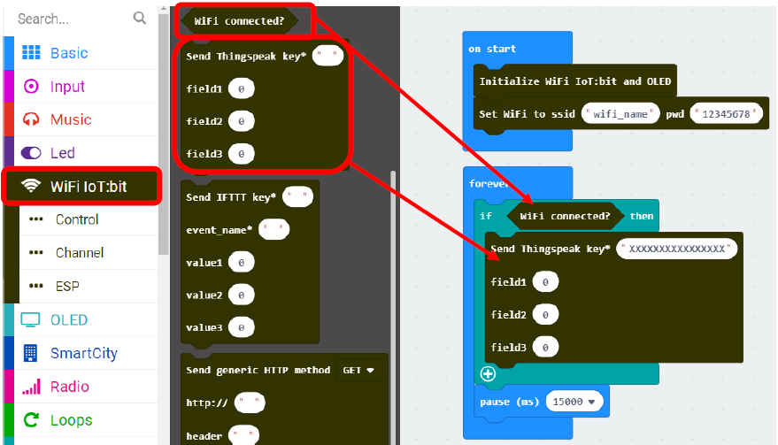

Step 4
* Open your program and paste the ThingSpeak key and paste it here.
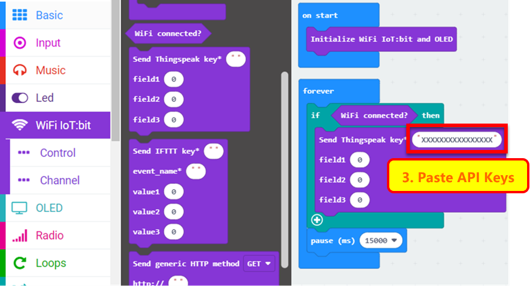

## Result
* If data is uploaded successfully, “Uploaded OK” will be shown.
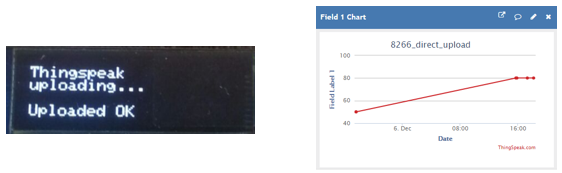
* The charts in your channel in ThingSpeak will be updated.
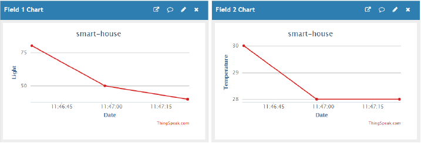
