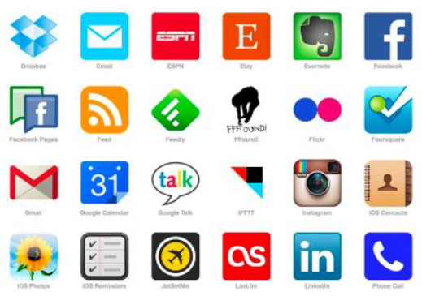
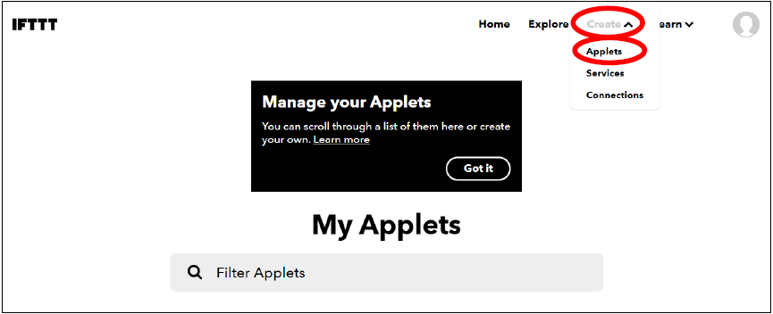
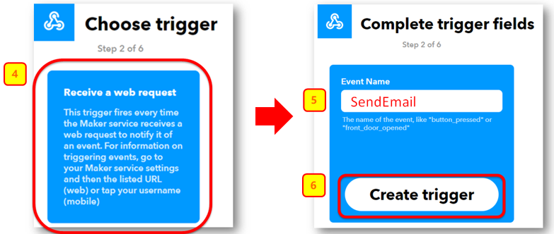
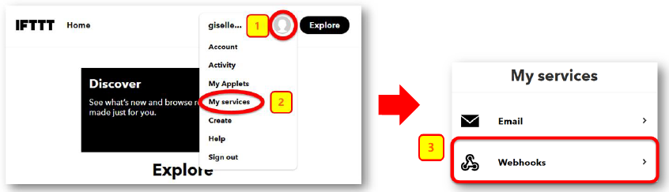
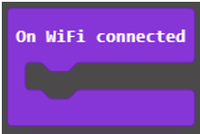
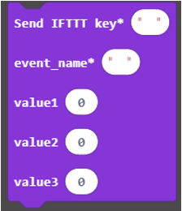
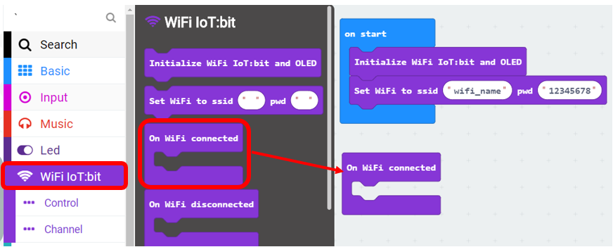
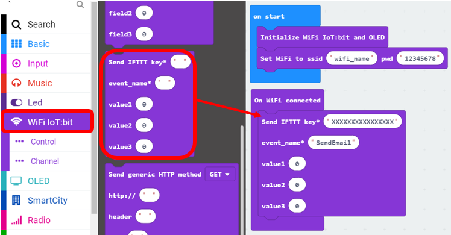
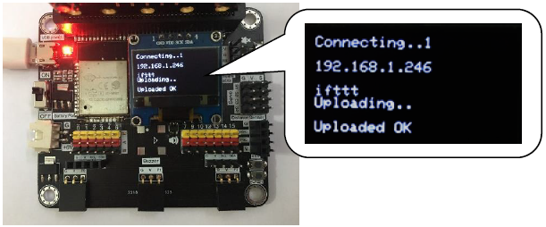

# Chapter 3: Send Email by IFTTT

## Create event “Email” in IFTTT

1. Go to http://www.ifttt.com, open the top right menu, then click「Create」

2. Select this -> select webhooks -> input Event Name (eg. Event Name: SendEmail)，then click "Create trigger"

3. Select "That" > Email

4. Select "Send me an email", Input email title and body, then click "Create action"

## Find your IFTTT key

1. Open your web browser, open the top right menu, select「My services」>「Webhooks」。

2. Select「Documentation」，Copy your Webhooks Key as follows:

## Trigger Email by IFTTT in MakeCode

1. It will trigger the following function once after connected with WiFi.

2. This function will send data (field1, field2, field3) and trigger event to IFTTT with the key provided

3. Select「IoT」> 「On WiFi connected」 and 「IoT」>「Send IFTTT key….」.

4. Once WiFi is connected, it will send IFTTT request once.

5. Input the following value
a.IFTTT API key: “HnXXXXXXXXXXXXXjb “. 
b.value 1-3: input value。
c.event_name: event name to trigger in Webhooks (eg. SendEmail)

6. If data is uploaded successfully, “Uploaded OK” will be shown.
