# Chapter 4: Control your micro:bit by App inventor 2/Web 

In this example, PC/mobile and micro:bit are connected to LAN network through WAN
PC/mobile will send a control command “Pin_On” to micro:bit. When the micro:bit receive the command, it will turn on the module on the pin.

***Before we control the micro:bit, please make sure your micro:bit is connected to the Wi-Fi.

## What is API
API is HTTP URL, it is one of the way to communicate with other objects.
http://54.202.26.42:8080/publish?id=DeviceID&msg=ControlCommand

## Example 1: Control your micro:bit with modules

### Know the API (control command without value)
http://54.202.26.42:8080/publish?id=DeviceID&msg=ControlCommand

### Programming (MakeCode)
Step 1. Start WiFi remote control 
* Connect micro:bit to WiFi.

Step 2. Set the Wi-Fi listening on Micro:bit WAN control command action
* If Wan command “Pin_On” is received, white LED will be turned on.
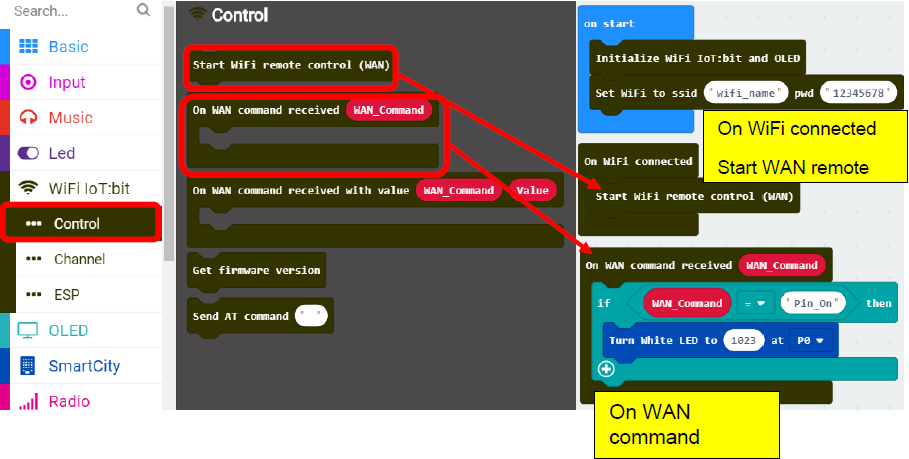

Step 3. Get micro:bit Device ID
* Load the program to the micro:bit and connect the micro:bit to the WiFi IoT:bit.
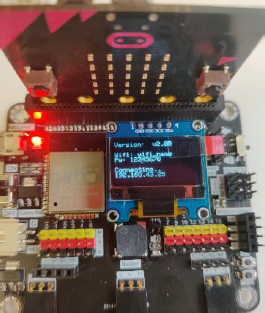

* Wi-Fi IoT:bit will start to connect to internet, when the connection is successful, the IP Address would be shown. 
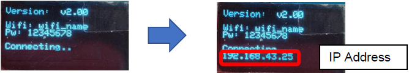

* Then, it will start WAN remote control. If the connection is successful, the Device ID would be shown.
* Remember the Device ID, it will be used for WAN connection on the next step.
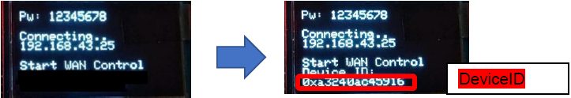
 

### Result (WEB)

Step 1. Get WAN control URL (command without value)
* The WAN control command URL is:
http://54.202.26.42:8080/publish?id=DeviceID&msg=ControlCommand
* Open your web browser and input control command URL, then press “enter”

Step 2
* After connected to WAN remote control is started, when Button1 is clicked, it will send WAN command “Pin_On” to the micro:bit with provided Device ID.
* The LED on P0 will be turned on.
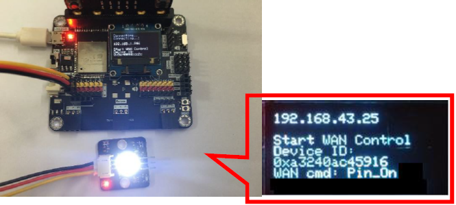

### Result (App inventor 2)

Step 1. Get WAN control URL (command without value)

* The WAN control command URL is:
http://54.202.26.42:8080/publish?id=DeviceID&msg=ControlCommand

Step 2. Get controlled by mobile app in App Invetor
* In below example, you can create a web connection, set the URL to the control command URL in App inventor.

A. Designer
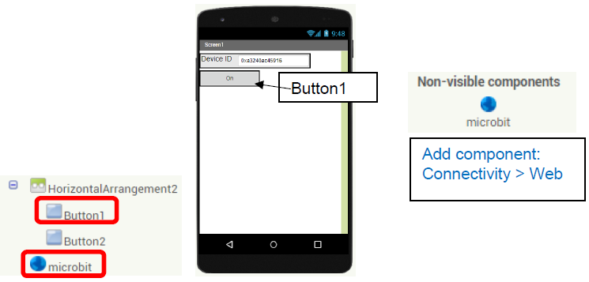  

B. Blocks
* When the remote button is clicked, it direct to the command URL, and control the micro:bit by Wi-Fi (WAN connection). 
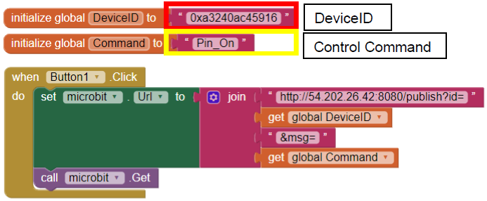

Step 3 
* After connected to WAN remote control is started, when Button1 is clicked, it will send WAN command “Pin_On” to the micro:bit with provided Device ID.
* The LED on P0 will be turned on.

## Example 2: Set the parameter via Wi-Fi (e.g. clock)

### Know the API (control command without value)
http://54.202.26.42:8080/publish?id=DeviceID&msg=ControlCommand

### Programming (Makecode)

Step 1. Set the Wi-Fi listening on micro:bit WAN control command action
* Using variable is useful when you need to change a program setting in micro:bit; for example: clock
* Also, you will need parameters “hour” for the clock.
* The initial value for the clock (hour) is 0.

* Connect Wi-Fi remote control (WAN) after Wi-Fi connected.
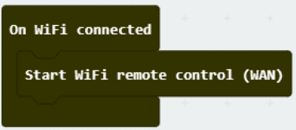

* After an hour, the parameter “hour” will be changed by 1.
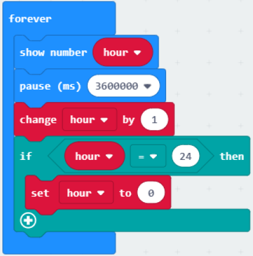

* The time (current hour) can be changed by a WAN command received:
> * Device ID: Your micro:bit Device ID (to identify micro:bit device to receive the command)
> * WAN_Command: SetHour (command for micro:bit)
> * Value: 6 (the value for the command)
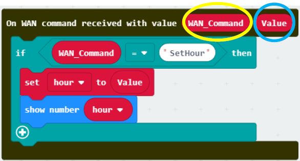

Step 2. Get micro:bit Device ID
* Load the program to the micro:bit and connect the micro:bit to the WiFi IoT:bit.

* Wi-Fi IoT:bit will start to connect to internet, when the connection is successful, the IP Address would be shown. 
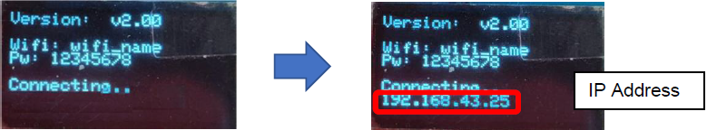

* Then, it will start WAN remote control. If the connection is successful, the Device ID would be shown. 
* Remember the Device ID, it will be used for WAN connection on the next step.
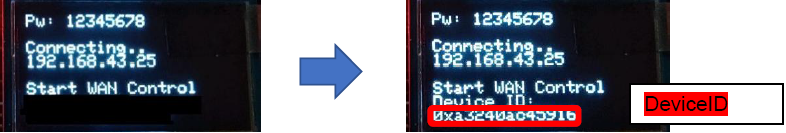

### Result (WEB)

Step 1. Send controlled by browser (command with value)
* The control command URL is:
http://54.202.26.42:8080/publish?id=DeviceID&msg=ControlCommand&value=value

* Open your web browser and input control command URL, then press “enter”

### Result (App inventor 2)

In this example, you can create a web connection, set the URL to the control command URL (http://54.202.26.42:8080/publish?id=0xa3240ac45916&msg=SetHour&value=6)

A. Designer
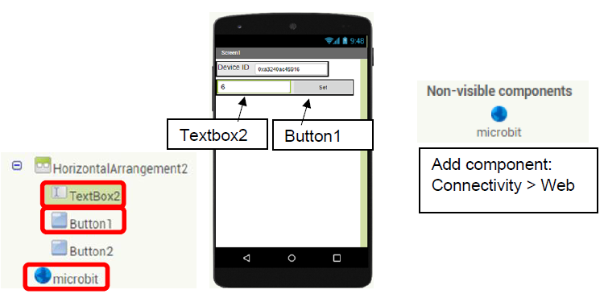

B. Blocks
* When the remote button is clicked, it direct to the command URL, and control the micro:bit by Wi-Fi (WAN connection).

* After connected to WAN remote control is started, when Button1 is clicked, it will send WAN command “SetHour” with value “6’ to the micro:bit with provided Device ID.
![pic]_600(images/Ch4_22.png)

* Once it receives the WAN command (SetHour) with value (6), the updated value will be shown. 

