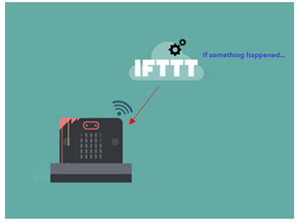
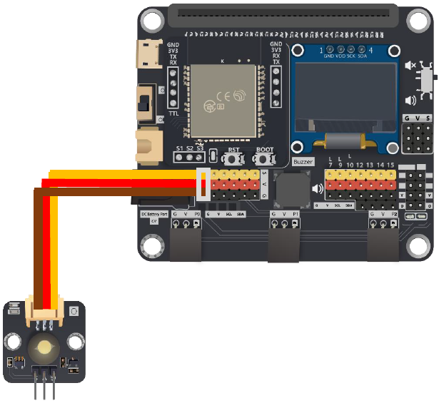
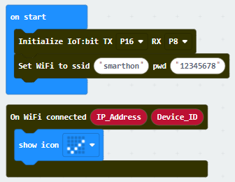
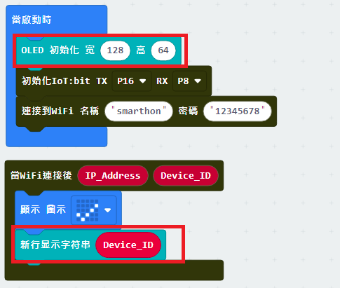
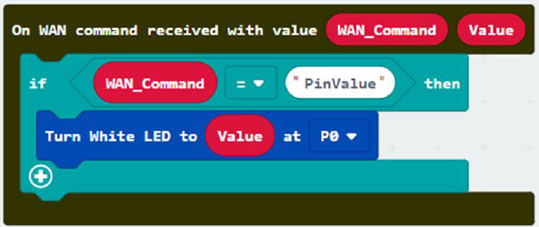
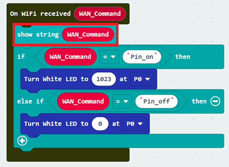
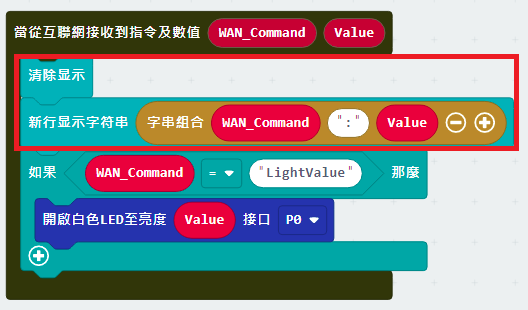
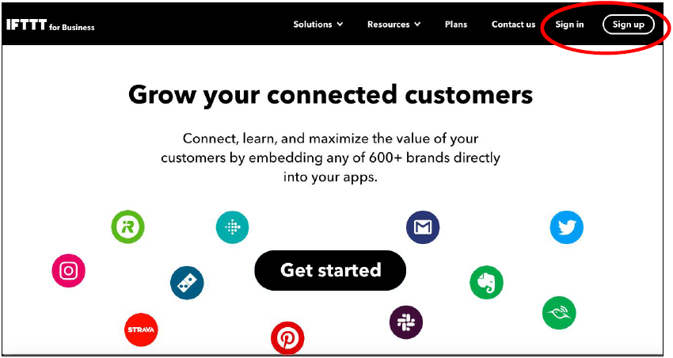
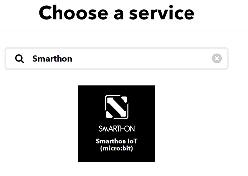
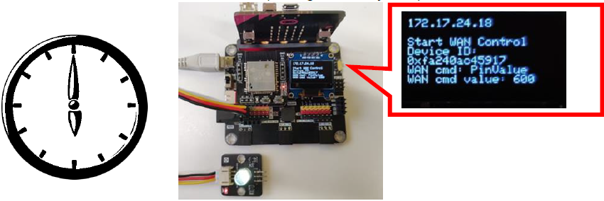

# 章節4: 由IFTTT雲控制Micro:bit

## 簡介
在這章節，你會學習到如何使用IFTTT控制Micro:bit。 在IFTTT平台上提供了各種服務，例如天氣預測、時間、語音助理等，只要設定好平台後，都能夠用來控制Micro:bit。  

這裡提供數種應用的例子:
* 在每天上午6時打開LED街燈
* 在每天上午6時打開水泵進行灑水2秒
* 若天氣預測到將會下雨，打開雨傘
* 使用聲音控制機械人動作
* 當門關上時，打開LED

## 示範場境

目標: 

將Micro:bit連接上網絡，在每天的下午6時，通過IFTTT傳送指令讓Micro:bit打開LED。

詳情:

在這例子裡，分為兩部分: 

* 第一部分，需要先把Micro:bit連接上網絡及知道其ID 
* 第二部分， 在IFTTT裡設定好觸發條件，如在下午6時，就發送 `light_on` 指令

## 第一部分: 編程

目標:

我們需要取得ID及設定好接收指令後相應的行動 

連接圖表: 
* 連接LED到P0 

* 請把蜂鳴器開關 "上拉" 以斷開連接

第一步驟: 連接Wi-Fi 

先初始化IoT:bit及連上Wi-Fi

第二步驟:取得ID 

 `當WiFi連接後`是一個事件處理器，當連接上Wi-Fi後就會執行裡面的內容。同時這也提供了IoT:bit ID的變數，我們可以用OLED顯示屏把ID顯示出來。 

* 初始化OLED顯示屏
* 在 `當WiFi連接後` 裡添加 `顯示字符串`
* 把 `Deveice_ID` 拖動到 `顯示字符串` 內

*如你害怕忘記了ID，亦可以在互聯網控制那分頁取得裝置ID，並按需要在某時候顯示出來

第三步驟:設定接收指令後的行動 

當連接上Wi-Fi後，與控制伺服器的連接將會自動建立，可以接收訊息。 
若要提取接收到的訊息，可以使用 `當從互聯網接收到指令`來讀取訊息。然後依照訊息來執行不同的動作。

* 在 `當從互聯網接收到指令` 在添加 `如果` 條件式

* 在設定條件時，對接收到的訊息進行對比，是否與我們設定的指令相同

* 當接收到 `light_on` 時，把LED打開

* 當接收到 `light_off` 時，把LED關閉

第四步驟:顯示接收的指令 

在接收指令時，或者有需要把指令顯示出來以方便知悉，使用OLED顯示屏就能輕易地看到指令。
* 初始化OLED顯示屏
* 添加 `顯示字符串` 並把指令顯示出來

<H3><U>進階應用:指令+數值:</U></H3>

有時侯除了指令外，亦可能需要同時附加一個數值來控制，例如控制舵機轉動角度，LED的亮度等。 
這時侯需使用另一個事件處理器 `當從互聯網接收到指令及數值` ，就能夠同時讀取指令及數值，並依此進行操作。 

完整答案 

MakeCode: [https://makecode.microbit.org/_U1bHoyWHD7DD](https://makecode.microbit.org/_U1bHoyWHD7DD) 

你可以在以下網頁下載HEX檔案 
<iframe src="https://makecode.microbit.org/#pub:_U1bHoyWHD7DD" width="100%" height="500" frameborder="0"></iframe>

## 第二部分: IFTTT 設定

<H3>目標:</H3>
我們需要設定一個IFTTT Applet去控制Micro:bit

第一步驟: 建立IFTTT帳號

前往 [https://ifttt.com/](https://ifttt.com/) 註冊並登入的你帳號。 

第二步驟:建立一個Applet 

在右上角的菜單，點擊建立->Applet 

第三步驟:設定觸法條件 

IFTTT使用 '如果...則執行...動作' 的方式來運行，我們可以設定如在每天下午6時，執行開燈的指令發送。

<u>A. 觸發部分</u>

1.搜索 'Date' 然後選擇 'Date & Time'

2.設定好需要觸發的時間

* 選擇 '每天這時間..'
* 選擇下午6時0分後，創立這觸發條件

<u>B. 動作部分</u>

1.搜索 'micro:bit' 後選擇 'Smarthon IoT(micro:bit)' 

2.完成設定
* 選擇 'Control Command'
* 輸入IoT:bit的ID `Device ID` (e.g. 0xa3240ac45916) 及指令 `control command` (e.g. light_on)， 然後點擊儲存

<u>可選操作</u>

如果想發送帶有數值的指令，可以在Smarthon IoT(micro:bit)那選擇 'Control Command(with value)' 

## 結果

<H3><U>常規情況:</U></H3>
當Wi-Fi連接後，裝置的ID將會顯示出來，亦會自動連接到控制伺服器

* 在每天下午6時，IFTTT上的時鐘會觸發，讓IFTTT發送 `light_On` 指令到Micro:bit
* Micro:bit 接收到指令
* P0上的LED會被打開

<H3><U>進階應用(帶有數值):</U></H3>

若使用了帶數值的版本來傳送指令時，IFTTT上會多出一個數值輸入位置，可以讓我們輸入(例如600)
* 每天下午6時，IFTTT上的時鐘會觸法，讓IFTTT發送 `light_On` 及數值 `600` 
* Micro:bit接收到指令 `light_On`及數值 `600`
* 在P0的LED就會被以數值600的類比數值打開，而不是最亮的1023

