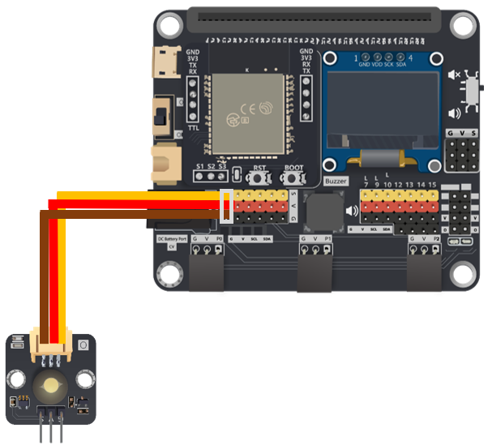
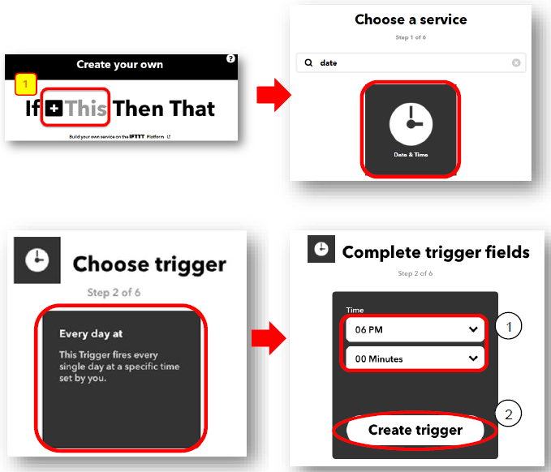
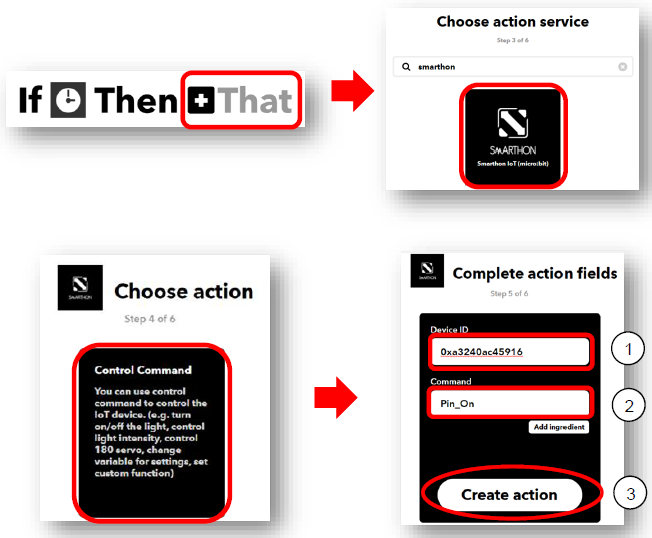
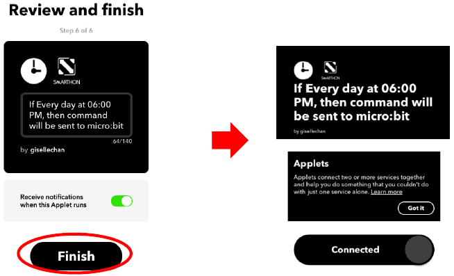
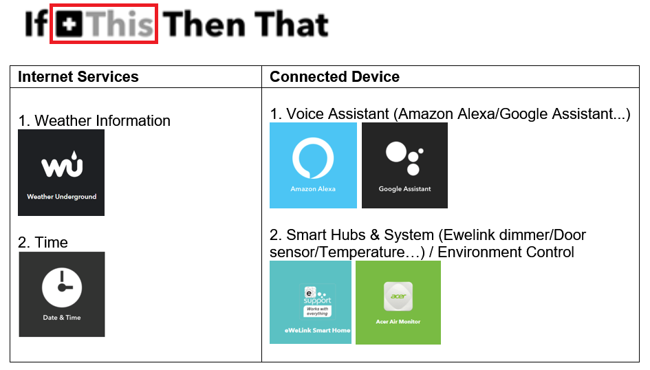

# Chapter 4: Cloud Control micro:bit by IFTTT Services

In this chapter , you will learn how to use trigger (other services) to implement action (micro:bit) by IFTTT. Below are the commonly used examples of services that can trigger micro:bit in IFTTT.  

 
## Examples of services used in IFTTT

With connection with different services in IFTTT, you can design your own applet with micro:bit projects using “if this then that (micro:bit)”.  

You can tailor-make your own micro:bit projects by connecting Smarthon IoT (micro:bit) to over hundreds of services in cloud (IFTTT)! Create your IFTTT applet by choosing “If THIS then THAT”. 

## Know the API (control command)

API is one way to communicate between the objects on the Internet world. API is just like an “URL” which is website link.

This is the API you can use to control the micro:bit

http://control.smarthon.cc/publish?id=`DeviceID`&msg=`ControlCommand`

http://control.smarthon.cc/publish?id=`DeviceID`&msg=`ControlCommand`&value=`Value`

## Coding

<B>Goal:</B> 
The below example is to turn on the light at 6 pm every day. 

<B><U>Connection Diagram:</U></B> 
* Connect LED to P0 

Step 1: Connect WiFi 

Before we try to use WiFi Control function, we need to connect to the network, we have already know how to connect to the WiFi on the first chapter.

Step 2: Get Device ID 

`On WiFi connected` is an event handler. It will be triggered once after connected with WiFi. The handler will provide the `Device ID` variable which used to identify and control the Microbit.

* Go to OLED Tab
* Snap `initialize OLED with width…height..` to `on start`
* Snap the `show string` inside the `On WiFi connected`
* Draw the `Device ID` variable from `On WiFi connected` to the `show tring` block placeholder

*If you worried about forget the `Device ID` during program running, you may access it by the variable under Control tab
* Go to Control tab
* Snap the `Device ID` variable to the placeholder

Step 3: Control with Command 

After connected to the WiFI, the connection to the server will be done automatically, it is ready to receive command though network. To get the command, we can use the `on Wi-Fi received` handler in WAN control tab.

* Snap the `on WiFi received` handler to stage
* Do the `if-condition statement` to the variable `WAN_Command`
* If `Wan_command` “Pin_on” is received, white LED will be turned on (intensity:1023)
* If `Wan_command` “Pin_off” is received, white LED will be turned off (intensity:0)

Attention: Please be aware that the **P** is in capital letter.

<H3><U>Advanced Usage(with value):</U></H3>

If you want to control the module with value, you can use the another block which contain `value` variable. 
If `Wan command` “PinValue” is received, white LED will be turned on with the given intensity `value`.

Full Solution 

MakeCode: [https://makecode.microbit.org/#pub:_JqFcEAXWJ032](https://makecode.microbit.org/#pub:_JqFcEAXWJ032) 

You could also download the program from the following website: 
<iframe src="https://makecode.microbit.org/#pub:_JqFcEAXWJ032" width="100%" height="500" frameborder="0"></iframe>

## Create your own Applet to control micro:bit in IFTTT

<H3>Goal:</H3>
We need to setup the IFTTT Applet to control the Mircobit

Step 1: Create or login to IFTTT account 
Open your browser , go to [https://ifttt.com/](https://ifttt.com/). Register your IFTTT account and once completed, log in to your IFTTT account. 

Step 2: Create Applets 

On the top right menu, click “Create” > “Applets” 

Step 3: Create the <u>trigger</u> of Applets 

Create a trigger for the applet 

* Select “This” > Choose service “Date & Time”
* Choose trigger “Every day at” 
* Select the time (e.g. 06PM, 00 Minutes; it means every day at 6pm) and click “Create trigger”.

Step 4: Create the action of Applet 

Create an action for the applet
* Select “That”, choose action service “Smarthon”
* Choose action “Control Command”
* Input your `Device ID` (e.g.0xa3240ac45916) and control command (e.g. Pin_On). Then click “Create action”.

Step 5: Review the configuration 

Review your applet, then click “Finish ”.  

Step 6: Ready to use 

After, the applet connection has been created it will show “connected”.  

The light will be turned on at 6pm every day! 

<H3><U>Advanced Usage(with value):</U></H3>

Step 1: Create the applet 

You can send WAN command with value in IFTTT. In this example, click “That” to select the action 

        
Step 2: Setup the applet 

Create an action for the applet
* Select “That”, choose action service “Smarthon”
* Choose action “Control Command (with value)”
* Input your Device ID (e.g. 0xfa240ac45917), control command (e.g. PinValue) and Value (e.g. 600). Then click “Create action”.

 
 

## Result

<H3><U>Normal Case:</U></H3>

After connected to WiFi, micro:bit will connect to control server and keep listening to the WAN command

* Every day at 6pm, clock will trigger IFTTT to send out micro:bit WAN command “Pin_On”
* Micro:bit will recevie the command
* The LED on P0 will be turned on.

<H3><U>Advanced Usage(with value):</U></H3>

When change the applet to contain value version, it will have an additional variable `value` included
* Every day at 6pm, clock will trigger IFTTT to send out micro:bit WAN command “PinValue” (with value “600”)
* Micro:bit will recevie the command
* The LED on P0 will be turned on (with light intensity: 600).

