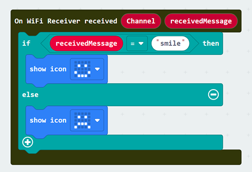
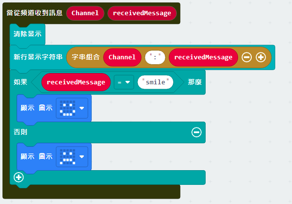
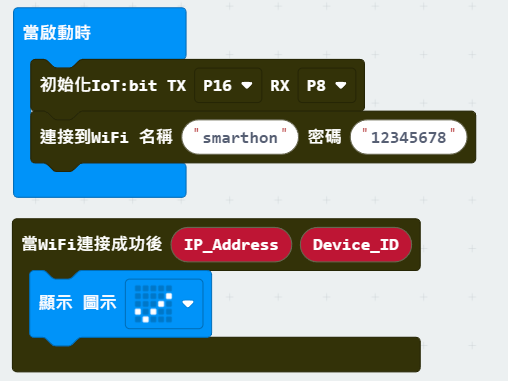
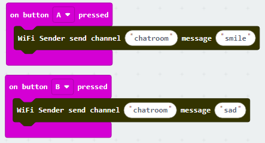

# Chapter 5: Object to Object communication

In this example, micro:bit (sender and receiver) are connected to a channel called “chatroom”. 

Peter want to send a smile message to Sally via internet (WAN). Peter’s micro:bit will send a Wi-Fi message “smile” to Sally’s micro:bit. When Sally receive a WiFi message smile, her micro:bit LED will show a smile icon. 

*Before we control the micro:bit, please make sure your micro:bit is connected to the Wi-Fi. 

 
## Receiver side

Goal:

The receiver joins the channel, set the corresponding action when message received.

Step 1: Connect Wi-Fi 

Before we join the channel, we need to connect to the network first. We have already known how to connect to the Wi-Fi on the first chapter.

Step 2: Join the channel 

We can let the Micro:bit listening on specific channel to receive the command 
* Snap the `on button A+B pressed` to stage
* Put the `WiFi Receiver join channel` to the `on button A+B pressed`
* Type the name of the channel “Chatroom”

*<B>The user can join more than 1 channel, the maximum is 4.</B>

Step 3: Set the corresponding action 

After press the A and B button at the same time, Micro:bit will start listening on channel “chatroom” to wait other people send message to it. We need to use the `On WiFi Receiver received` to read the command and take action.

* Snap `On WiFi Receiver received` to stage
* If need to received include value message, can use the <b>include value version</b> `On WiFi Receiver received` at the same time 
* Do the `if-condition statement` to the variable `receivedMessage`
* When the `receivedMessage` called “smile”, the LED will show a smile icon; 
* When the `receivedMessage` not called “smile”, the LED will show a sad icon. 

Full Solution 

MakeCode: [https://makecode.microbit.org/_KbxHgu7xfHhP](https://makecode.microbit.org/_KbxHgu7xfHhP) 

You could also download the program from the following website: 
<iframe src="https://makecode.microbit.org/#pub:_KbxHgu7xfHhP" width="100%" height="500" frameborder="0"></iframe>

<h2>Optional:</h2>

1. Check channel joined status

When the Receiver was joined the channel, it can check the listening was started successfully or not. The `On WiFi channel joined` will provide the `Error_code` for you to determine the result.
* Go to the OLED Tab
* Snap `initialize OLED …` to `on Start`
* Snap the `On WiFi channel joined` to stage
* Use `show string` to show the `Error_code` with `channel` name

If `Error_code` is 0, means no error occur 
If `Error_code` is not 0, means error occur 
Normally, if no internet connection or the Channel Server is down, the code will be -28674

2. Show the source channel name of the message 

When you join different channels, you may receive same command from each of them alternately, so you need to identify the message is come from which channel. The `On WiFi Receiver received` provide the variable used to identify. 
* Snap `clear OLED display` to make sure the display will not overlap.
* Snap `show string` to the `On WiFi Receiver received`
* Draw the `Channel` and `receivedMessage` variable to the `show string` to display the on OLED

Full Solution 

MakeCode: [https://makecode.microbit.org/_ApFMuua7d072](https://makecode.microbit.org/_ApFMuua7d072) 

You could also download the program from the following website: 
<iframe src="https://makecode.microbit.org/#pub:_ApFMuua7d072" width="100%" height="500" frameborder="0"></iframe>

## Sender side

Goal: 

 The sender can send the message to specific channel
 
Step 1: Connect WiFi 

Before we try to use WiFi Control function, we need to connect to the network, we have already know how to connect to the WiFi on the first chapter.

Step 2: Send the message 

After connected to the internet, we can start send the message to our friend though the channel. 
* Snap the `on button … press` to stage
* Snap the `WiFi Sender send channel…` inside the `on button … press`
* Input the correct channel name for your target channel, for example chatroom
* Input the message which need to be send
* If need to send the message with value, use another version of `WiFi Sender send channel…` which **include the value input** 

Full Solution 

MakeCode: [https://makecode.microbit.org/_AygdmqgfTCXb](https://makecode.microbit.org/_AygdmqgfTCXb) 

You could also download the program from the following website: 
<iframe src="https://makecode.microbit.org/#pub:_AygdmqgfTCXb" width="100%" height="500" frameborder="0"></iframe>

<h2>Optional:</h2>

Check message sent status:

When the sender sending the message, if use the `On WiFi message sent`, it can know the sending result of message to channel. 
* Go to OLED Tab
* Snap the `initialize OLED…` to `on Start`
* Snap the `On Wifi message sent` to stage
* Snap the `show string` inside to `On Wifi message sent`
* Snap the `clear OLED display` to avoid overlap
* Draw the `Status` and `Error_code` variable into the `show string` text placeholder

If the sending result is success, the `Status` will be `OK` and `Error_code` is `0` 
If the sending result is fail, the `Status` will be `FAIL` with `Error_code` 
Normally, if no internet connection or the channel Server is down, it will be -28674

Full Solution 

MakeCode: [https://makecode.microbit.org/_2H1fHvgMv6jg](https://makecode.microbit.org/_2H1fHvgMv6jg) 

You could also download the program from the following website: 
<iframe src="https://makecode.microbit.org/#pub:_2H1fHvgMv6jg" width="100%" height="500" frameborder="0"></iframe>

