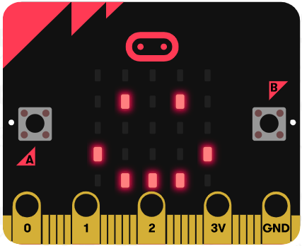

# Chapter 5: Object to Object communication

In this example, micro:bit (sender and receiver) are connected to a channel called “chatroom”. 

Peter want to send a smile message to Sally via internet (WAN). Peter’s micro:bit will send a Wi-Fi message “smile” to Sally’s micro:bit. When Sally receive a WiFi message smile, her micro:bit LED will show a smile icon. 

*Before we control the micro:bit, please make sure your micro:bit is connected to the Wi-Fi. 

 
## Set the channel name (Receiver)

Step 1 

After initializing, you can connect to the WiFi: 

Choose `IoT:bit` -> `Set Wi-Fi to ssid “”, pwd “”`. Enter your Wi-Fi name and password 

Step 2 

`On WiFi connected` is an event handler. 

It will be triggered once after connected with WiFi. 

Step 3 

When Wifi is connected, it start WiFi Listening in channel “chatroom”  

(sender and receiver must be in the same channel) 

* When it receive a WiFi message called “smile”, the LED will show a smile icon; 
* when it receive a WiFi message called “sad”, the LED will show a sad icon.

Full Solution 

MakeCode: [https://makecode.microbit.org/_boM473hYHeVw](https://makecode.microbit.org/#pub:_boM473hYHeVw) 

You could also download the program from the following website: 
<iframe src="https://makecode.microbit.org/#pub:_boM473hYHeVw" width="100%" height="500" frameborder="0"></iframe>

## Send Wi-Fi message in a channel (Sender)

Step 1 

After initializing, you can connect to the WiFi: 

Choose `IoT:bit` -> `Set Wi-Fi to ssid “”, pwd “”`. Enter your Wi-Fi name and password 

Step 2 

After WiFi is connected, we can press button A / button B to send WiFi message 

(the channel name of the sender and receiver must be the same) 

* Button A: send a WiFi message “smile” to channel “chatroom” 
* Button B:  send a WiFi message “sad” to channel “chatroom” 

Full Solution 

MakeCode: [https://makecode.microbit.org/_2pWTEyLWqFDu](https://makecode.microbit.org/#pub:_2pWTEyLWqFDu) 

You could also download the program from the following website: 
<iframe src="https://makecode.microbit.org/#pub:_2pWTEyLWqFDu" width="100%" height="500" frameborder="0"></iframe>

## Result

### Sender
After connected to WiFi, IP address would be shown. 

Pressed “A” button, it will send WiFi message “smile” in channel “chatroom”.  

 
Pressed “B” button, it will send WiFi message “sad” in channel “chatroom”.  

### Receiver
After connected to WiFi, IP it will start listening in channel “chatroom”. When connected successfully, Channel name “chatroom” will be shown. 

* When WiFi message “smile” is received, OLED will show “WIFI msg: smile”. Micro:bit will show an smile icon: 

* When WiFi message “sad” is received, OLED will show “WIFI msg: smile”. LED will show a sad icon: 

