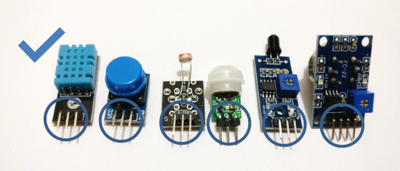
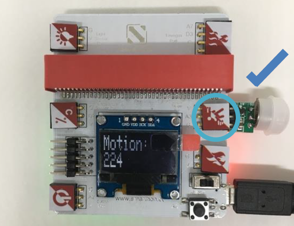
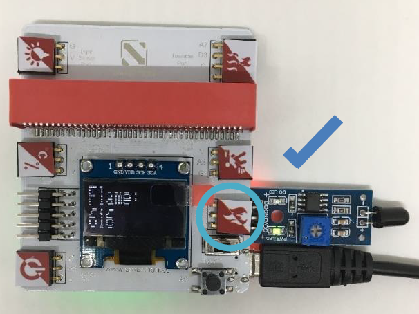
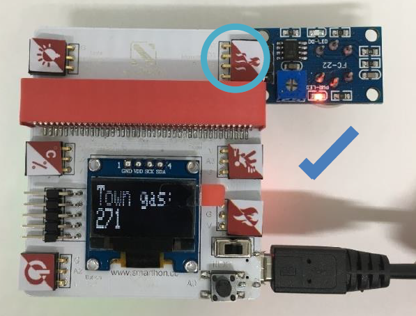
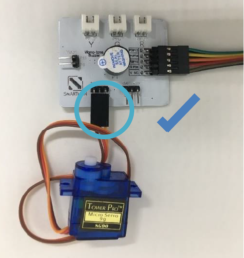
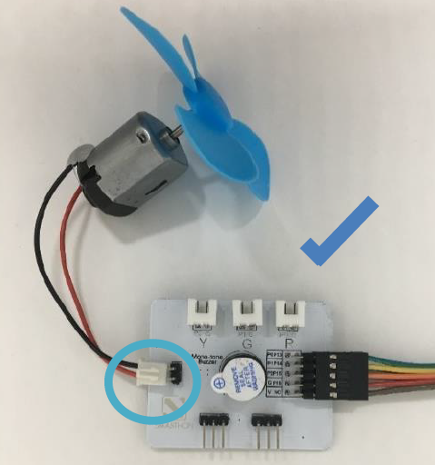
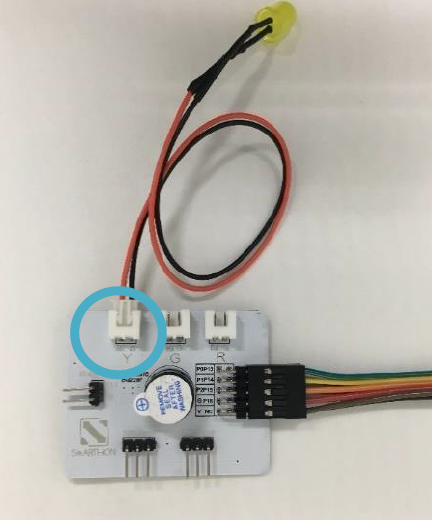
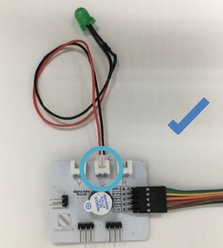
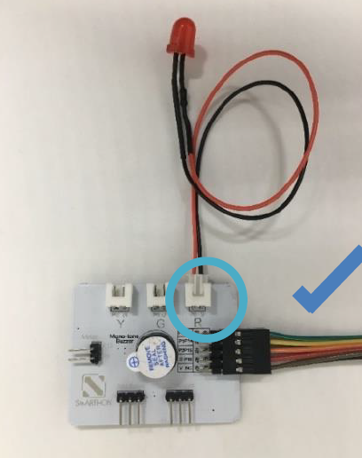
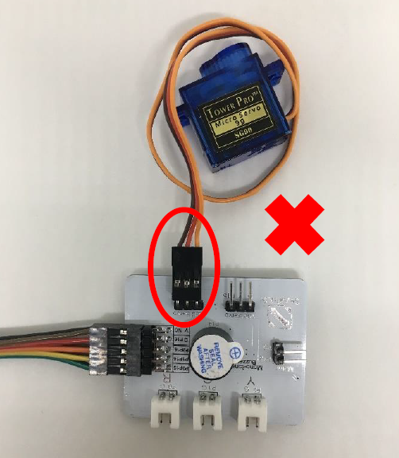

# Hardware User Guide

## A. The Sensors
How to connect the sensor modules and Multiple Sensors for smart house?

Please follow the instructions shown below to plug sensor modules into Multiple Sensors correctly to ensure all the modules work effectively.

All Sensors:

1. Light Sensor

2. Temperature and Humidity Sensor

3. Button

4. Motion Sensor

5. Flame Sensor

6. Town Gas Sensor

 Caution! 

**Incorrect Plug-in:**

User should **NOT** plug the sensors into the Multiple Sensors for smart house at incorrect format as shown in below. Incorrectly plugging in the Multiple Sensors will cause:

1. an error of the sensor value
2. **electrical short circuit** as well as damage the sensors or Multiple Sensors for smart house

You must always be concerned with your own safety first and cut-off power supply and remove sensors under safe conditions

 Incorrect Plug-in Example 1: 

 Incorrect Plug-in Example 2: 

## The Actuators

How to connect the actuator modules and Multiple Actuators for smart house?

Please follow the instructions shown below to plug actuator modules into Multiple Actuators correctly to ensure all the modules work effectively.

1. 180° Servo

2. 360° Servo

3. Motor Fan

4. LED Light (Yellow)

5. LED Light (Green)

6. LED Light (Red)

 Caution! 
Actuators will not work properly if users connect it with the Multiple Actuators incorrectly.

Incorrect Plug-in Example:
