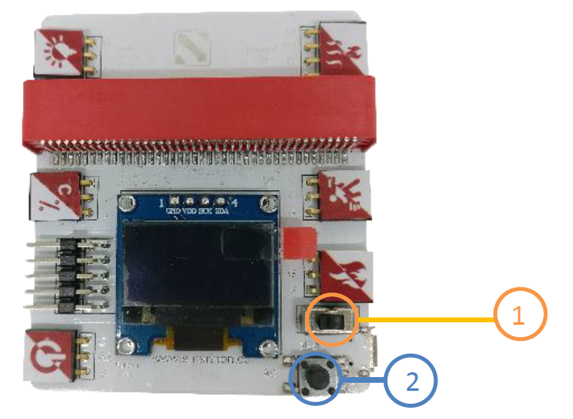
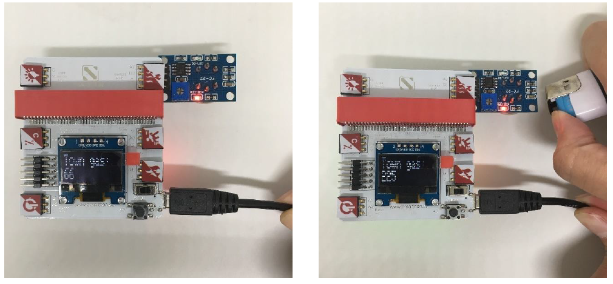

# Reading all the sensors on screen: Button, Temperature & Humidity sensor, Light sensor, Motion sensor, Flame sensor and Town gas sensor

Part List:
1. Multiple Sensors for plant X1
2. Button X1
3. Temperature & Humidity sensor X1
4. Light sensor X1
5. Motion sensor X1
6. Flame sensor X1
7. Town gas sensor X1
8. USB Cable

You should learn how to read the sensor value which is the foundation of the other projects.

1. Switch on the power button first (orange colour)
2. Pressed the button in the right bottom corner of the Multiple Sensors for smart house (blue colour)

It shows the instant value of the digital light sensor, temperature, humidity, button, motion, flame as well as town gas sensor.

Button, Light Sensor and Town gas sensor are shown as examples:

<b>Button</b>

When you plug in the button, the screen shows 0 or 1 (small number); while when you pressed the button, the screen shows around 1020 - 1023 (large number). It indicates that a large number will be shown when you pressed the button.

<b>Light Sensor</b>

When there is a light turning on, the light sensor value is around 280-300; otherwise when you use a finger to cover the light sensor, it has increased into around 450-470. It reveals that the ambient lighting are getting brighter, the number of the light sensor value shown on the screen is getting smaller and vice versa.

<b>Town Gas Sensor</b>

In the normal condition, the town gas sensor value is around 30-50; while there is a town gas leakage, the number has increased from 200 – 850 subject to the concentration of different leakage velocities.

\* Please conduct a gas test in a well-ventilated area.

**Reading the other three sensors:**

Temperature & Humidity:____________________________________

Motion sensor:_____________________________________________

Flame sensor:______________________________________________

