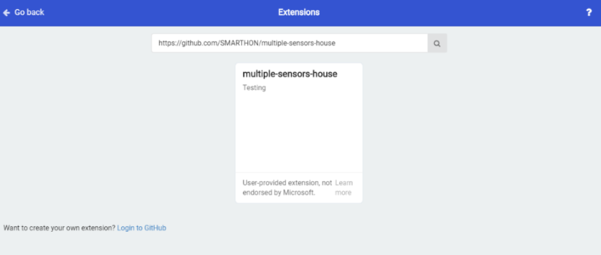
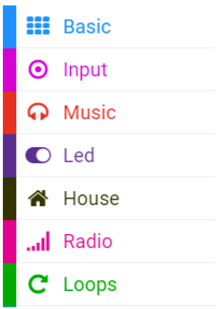

# Getting started: How to program Smarthon Smart House Kit on micro:bit

To Program Smarthon modules with micro:bit, you need to add the Smarthon Smart House Kit packages to the BBC micro:bit makecode platform and initialize it first.

**Steps:**

1. Find the “Extensions” block at the bottom 

2. Search “https://github.com/SMARTHON/multiple-sensors-house”

3. Clicked “multiple-sensors-house” and you can see “House” package has been successfully added under “Led”.

4. Initialize Smarthon Smart House Kit to add all the functions

