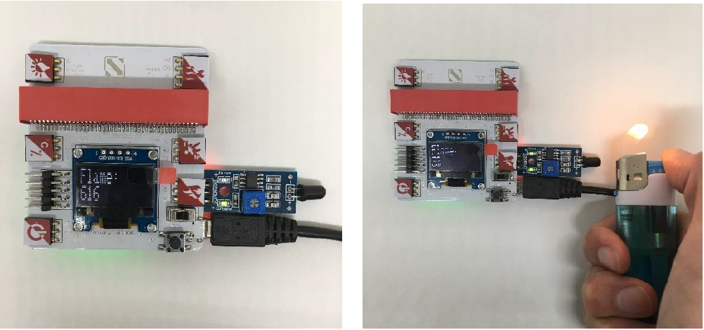

# Appendix I
**Reading Sensors Answer:**

##  Temperature & Humidity:
Please feel free to write down the value of the current condition.

## Motion Sensor:

If this sensor detects any movements, the value of the motion sensor will increase from 0 to 200, as shown in the picture.

## Flame Sensor:

If there is a fire, the number of the flame sensor will decrease from 600 to 30.

