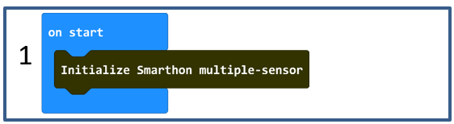
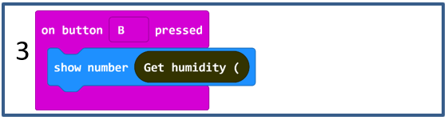

# Project 1: Read Sensors on micro:bit 25 LED lights
Level: 
## Part List
1. Temperature/Humidity Sensor X1
2. Multiple Sensors for smart house X1
3. Multiple Actuators for smart house X1
4. Connecting Wire X1
5. micro:bit X1
6. USB Cable X1

## Description
You can learn how to get the value of the sensor and show on micro:bit LED. Temperature/Humidity sensor will be illustrated in this demo.

## Steps
1. Basic (Add block on start) > House (Add block Initialize Smarthon multiple-sensor)
2. Input (Add block on button A is pressed) > Basic (Add block show number) > House (Add block Get temperature (°C))
3. Input (Add block on button A is pressed, change “A” into “B” ) > Basic (Add block show number) > House (Add block Get humidity)

## Hardware
1. Connect the Temperature/Humidity sensor to Temperature Sensor port of Multiple Sensors
2. Download the code and transfer to micro:bit
3. Plug the micro:bit into Multiple Sensors
4. Pressed micro:bit button A to see the temperature and button B to see the humidity

* Try to show the other sensors value on micro:bit LED.