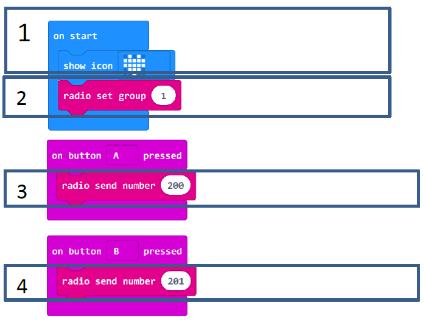
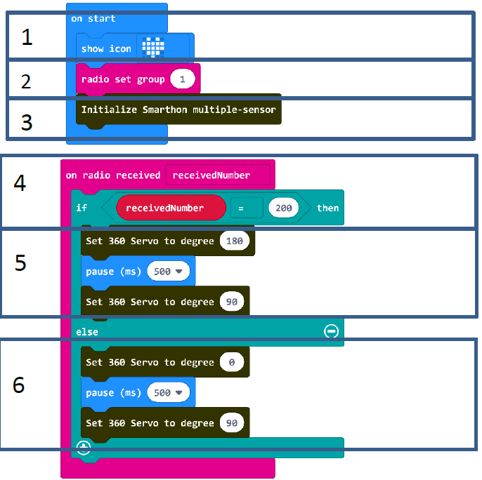
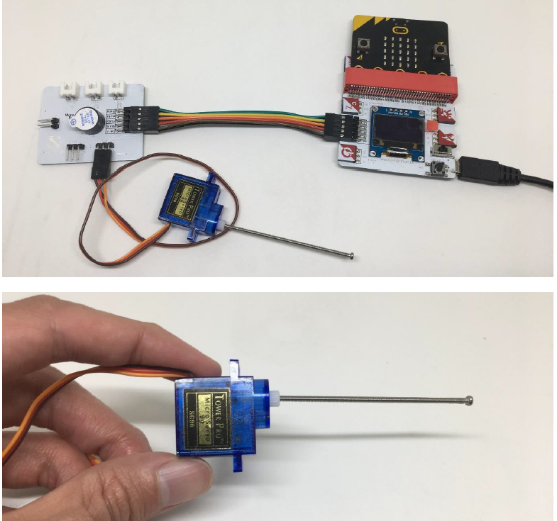

# Project 10:  Remote control on the curtain
Level: 
## Part List
1. 360° servo X1
2. Multiple Sensors for smart house X1
3. Multiple Actuators for smart house X1
4. Connecting Wire X1
5. micro:bit X2
6. USB Cable X2

## Description
In project 10, you will need 2 microbit. One is sender (controller). Another is the receiver (curtain machine). You can learn how to use micro:bit to remote control SMARTHON main board with curtain (360 servo) up and down.

## Sender Steps
1. Basic (Add block on start) > Basic (Add block show icon - heart)
2. Basic (Add block on start) > (Add block radio set group 0, change 0 to 1)
3. Input (Add block on button A is pressed) > Radio (Add block radio send number 0, change 0 to 200)
4. Input (Add block on button A is pressed > change “A” into “B” ) > Radio (Add block radio send number 0, change 0 to 201)

## Hardware
5. **Download** the code and transfer to micro:bit
6. Connect USB with micro:bit
7. Send the signal with button A/B pressed

## Receiver Steps
1. Basic (Add block on start) > Basic (Add block show icon - heart)
2. Basic (Add block on start) > (Add block radio set group 0, change 0 to 1)
3. Basic (Add block on start) > House (Add block Initialize Smarthon multiple-sensor)
4. Radio (Add block on radio received receivedNumber) > Logic (Add block if…then…else) > For if : Logic (Add block 0 = 0, change “0” to Variables “receivedNumber”; “0” to “200”)
5. For then: House (Add block Set 360 servo to degree 0, change 0 to 180); Basic (Add block pause (ms) 100, change “100” to “500”); House (Add block Set 360 servo to degree 0, change 0 to 90)
6. For else: House (Add block Set 360 servo to degree 0); Basic (Add block pause (ms) 100, change “100” to “500”); House (Add block Set 360 servo to degree 0, change 0 to 90)Basic (Add block pause (ms) 100)

## Hardware
7. **Download** the code and transfer to micro:bit
8. Plug the micro:bit into Multiple Sensors
9. Connect Multiple Sensors and Multiple Actuators by connecting wire
10. Connect 360° servo module to 360 servo port of the Multiple Actuators

* Let’s put on the hardware into the house model. 