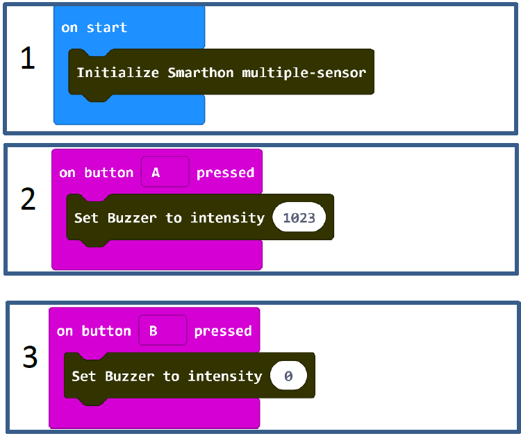
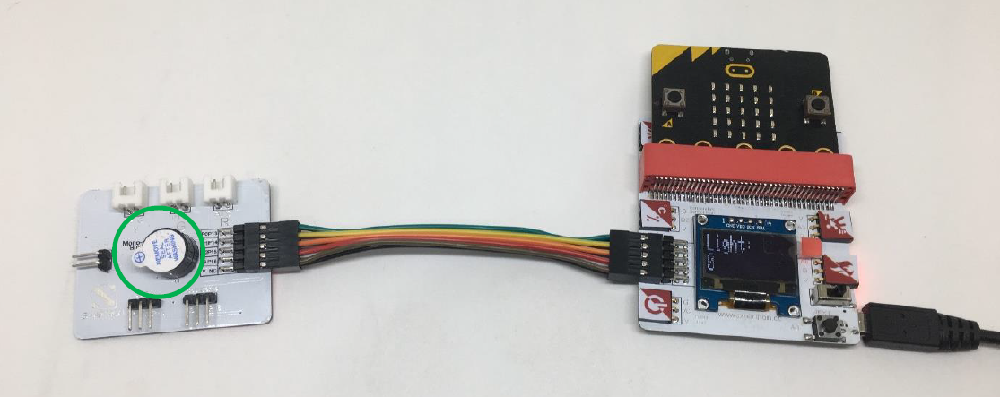

# Project 2:  Control Multiple Actuators Lv1
Level: 
## Part List
1. Mono-tone buzzer X1 (placed on Multiple Actuators for smart house)
2. Multiple Sensors for smart house X1
3. Multiple Actuators for smart house X1
4. Connecting Wire X1
5. micro:bit X1
6. USB Cable X1

## Description
In project 2, you can learn how to use micro:bit button A & B to control mono-tone buzzer as an example in this demo.

## Steps
1. Basic (Add block on start) > House (Add block Initialize Smarthon multiple-sensor)
2. Input (Add block on button A is pressed) > House-More (Add block Set Buzzer to intensity 0, change “0” to “1023”)
3. Input (Add block on button A is pressed, change “A” into “B”) > House (Add block Set Buzzer to intensity “0”)

## Hardware
4. **Download** the code and transfer to micro:bit.
5. Plug the micro:bit into Multiple Sensors.
6. Connect Multiple Sensors and Multiple Actuators by connecting wire.
7. Pressed micro:bit button A to turn to the buzzer and button B to turn off the buzzer.

* Try to use on shake to turn on and off buzzer. 