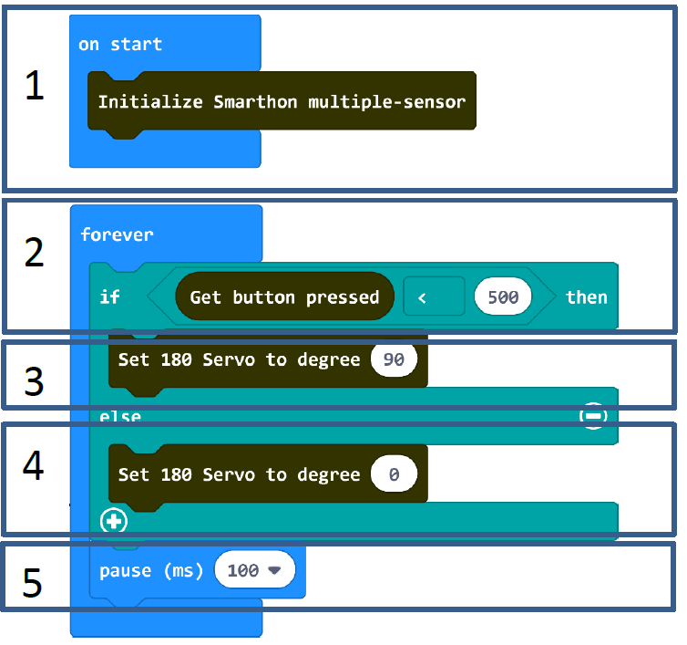
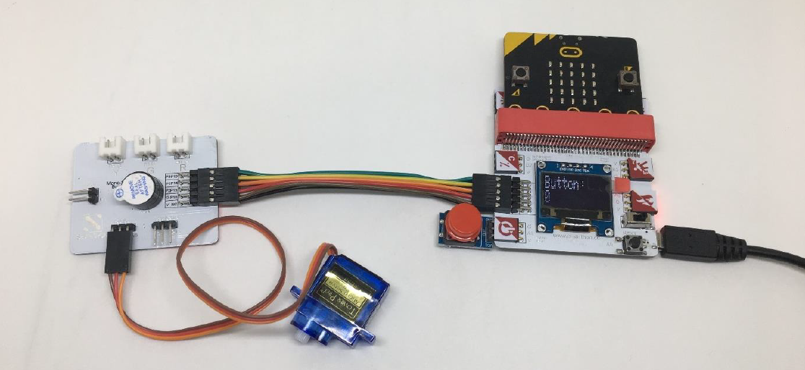

# Project 4:  Open the door
Level: 
## Part List
1. Button X1
2. 180° servo X1
3. Multiple Sensors for smart house X1
4. Multiple Actuators for smart house X1
5. Connecting Wire X1
6. micro:bit X1
7. USB Cable X1
8. Lolly Sticks X2

## Description
In project 4, you can learn how to use the button to open the door.

## Steps
1. Basic (Add block on start) > House (Add block Initialize Smarthon multiple-sensor)
2. Basic (Add block forever) > Logic (Add block if…then…else) > For if : Logic (Add block 0 = 0, change “0” to House “Get button pressed”; “=” to “<”; “0” to “500”)
3. For then: House (Add block Set 180 Servo to degree 0, change “0” to “90”)
4. For else: House (Add block Set 180 Servo to degree 0)
5. Basic (Add block pause (ms) 100)

*degrees of the servo have to be adjusted under the different condition

6. **Download** the code and transfer to micro:bit
7. Plug the micro:bit into Multiple Sensors
8. Connect Multiple Sensors and Multiple Actuators by connecting wire
9. Put the horn into 180° servo
10. Stick “+” with the lolly sticks and stick it up on the horn
11. Connect the module to 180° servo port of the Multiple Actuators and install it to the door
12. Pressed the button to open the door

* Try to use the other sensors, such as motion sensor to control the door. 

