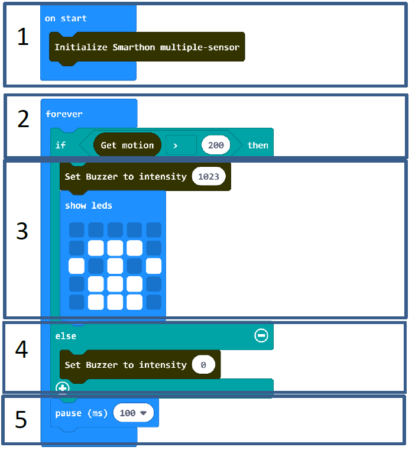
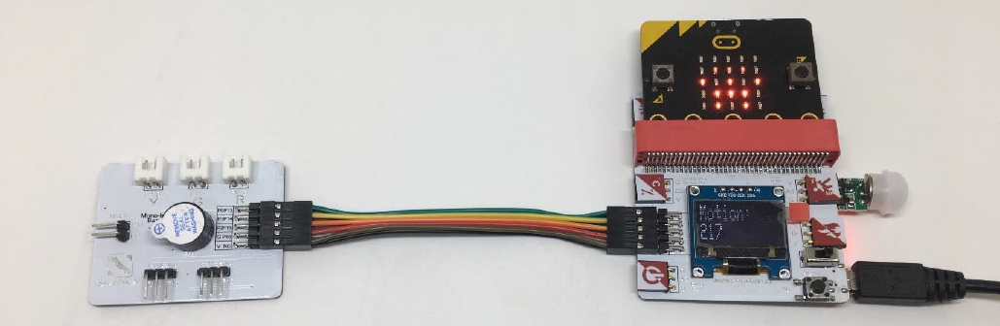

# Project 5:  Alarm System
Level: 
## Part List
1. Motion sensor X1
2. Mono-tone buzzer X1 (placed on Multiple Actuators for smart house)
3. Multiple Sensors for smart house X1
4. Multiple Actuators for smart house X1
5. Connecting Wire X1
6. micro:bit X1
7. USB Cable X1

## Description
In project 5, you can learn how to use motion sensor and buzzer to design an alarm system to maintain the house security.

## Steps
1. Basic (Add block on start) > House (Add block Initialize Smarthon multiple-sensor)
2. Basic (Add block forever) > Logic (Add block if…then…else) > For if : Logic (Add block 0 = 0, change “0” to House “Get motion”; “=” to “>”; “0” to “200”)
3. For then: House-More (Add block Set Buzzer to intensity 0, change “0” to “1023”) > Basic (Add block show leds – create a telephone symbol)
4. For else: House-More (Add block Set Buzzer to intensity 0)
5. Basic (Add block pause (ms) 100)

## Hardware
6. Connect the **Motion sensor** to Motion Trigger port of Multiple Sensors
7. **Download** the code and transfer to micro:bit
8. Plug the micro:bit into Multiple Sensors
9. Connect Multiple Sensors and Multiple Actuators by connecting wire
10. Try shake your hand nearby the motion sensor to test

* Try to use other actuators, such as LED lights (green and red) to make an alarm system. 

