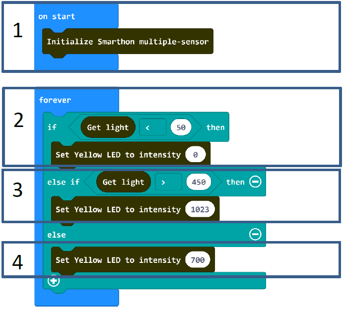

# Project 6: Light Automation
Level: 
## Part List
1. Light sensor X1
2. Yellow LED X1
3. Multiple Sensors for smart house X1
4. Multiple Actuators for smart house X1
5. Connecting Wire X1
6. micro:bit X1
7. USB Cable X1

## Description
In project 6, you can learn how to build a light automation in the house subject to the sunshine.

## Steps
1. Basic (Add block on start) > House (Add block Initialize Smarthon multiple-sensor)
2. Basic (Add block forever) > Logic (Add block if…then…else, add 1 more if…then…else) > For 1st if : Logic (Add block 0 = 0, change “0” to House “Get light”; “=” to “<”; “0” to “50”) > For then: House-More (Add block Set Yellow LED to intensity 0)
3. For else if: Logic (Add block 0 = 0, change “0” to House “Get light”; “=” to “>”; “0” to “450”) > For then: House-More (Add block Set Yellow LED to intensity 0, change “0” to “1023”)
4. For else: House-More (Add block Set Yellow LED to intensity 0, change “0” to “700”)

## Hardware
5. Connect the **Light sensor** to Light Sensor port of Multiple Sensors
6. **Download** the code and transfer to micro:bit
7. Plug the micro:bit into Multiple Sensors
8. Connect Multiple Sensors and Multiple Actuators by connecting wire
9. Connect the Yellow LED to Y port of the Multiple Actuators
10. Use the finger to cover the light sensor to see if the LED light can be turn on / Shining a torch to the light sensor to see if the LED light can be turn off

* Try to conduct the experiment under the dark environment or sunshine and adjust the value of the sensors or LED light to fit the different projects. 

