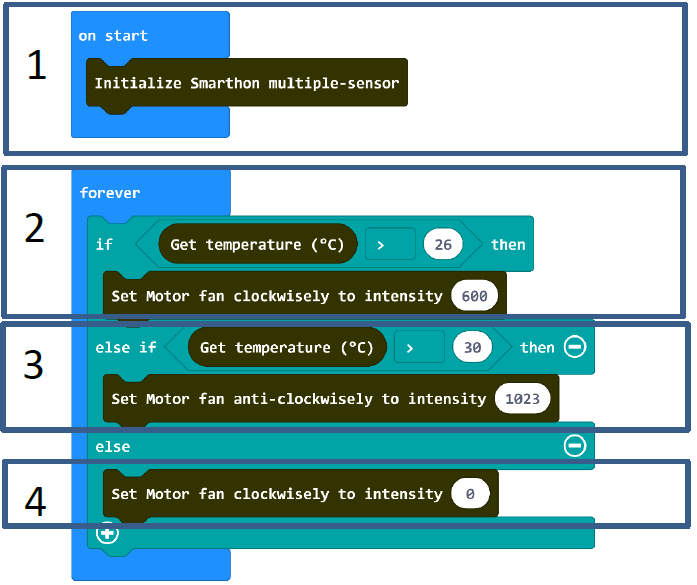

# Project 7: Smart Motor Fan
Level: 
## Part List
1. Temperature/Humidity sensor X1
2. Motor Fan X1
3. Multiple Sensors for smart house X1
4. Multiple Actuators for smart house X1
5. Connecting Wire X1
6. micro:bit X1
7. USB Cable X1

## Description
In project 7, you can learn how to make an smart fan automation that allows you to design a smarter and more comfortable house.

## Steps
1. Basic (Add block on start) > House (Add block Initialize Smarthon multiple-sensor)
2. Basic (Add block forever) > Logic (Add block if…then…else, add 1 more if…then…else) > For 1st if : Logic (Add block 0 = 0, change “0” to House “Get temperature(°C)”; “=” to “>”; “0” to “26”) > For then: House-More (Add block Set Motor fan clockwisely to intensity 0, change “0” to “600”)
3. For else if: Logic (Add block 0 = 0, change “0” to House “Get temperature(°C)”; “=” to “>”; “0” to “30”) > For then: House-More (Add block Set Motor fan anti-clockwisely to intensity 0, change “0” to “1023”)
4. For else: House-More (Add block Set Motor fan clockwisely to intensity 0)

## Hardware
5. Connect the Temperature/Humidity sensor to Temperature Sensor port of Multiple Sensors
6. Download the code and transfer to micro:bit
7. Plug the micro:bit into Multiple Sensors
8. Connect Multiple Sensors and Multiple Actuators by connecting wire
9. Connect the Motor fan to Motor port of the Multiple Actuators
10. Conduct the test to see if the motor fan can be turn on > 26°C

* Can you think of other possible combination for turning on the motor fan? Try to do it. 

