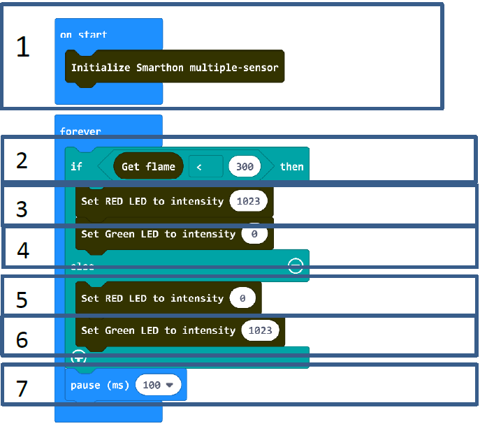

# Project 8:  Fire Alarm
Level: 
## Part List
1. Flame sensor x 1
2. Red LED X1
3. Green LED X1
4. Multiple Sensors for smart house X1
5. Multiple Actuators for smart house X1
6. Connecting Wire X1
7. micro:bit X1
8. USB Cable X1

## Description
In project 8, you can learn how to use micro:bit to make Alert LED (Red/Green). If the flame is detected, the Red LED will be turned on, the Green LED will be turned off. If there is no flame, Green LED is turned on and Red LED will be turned off.

## Steps
1. Basic (Add block on start) > House (Add block Initialize Smarthon multiple-sensor)
2. Basic (Add block forever) > Logic (Add block if…then…else) > For if : Logic (Add block 0 = 0, change “0” to House “Get flame”; “=” to “<”; “0” to “300”)
3. For then: House (Add block Set RED LED to intensity 0, change 0 to 1023)
4. For then: House (Add block Set Green LED to intensity 0)
5. For else: House (Add block Set RED LED to intensity 0)
6. For else: House (Add block Set GREEN LED to intensity 0, change 0 to 1023)
7. Basic (Add block pause (ms) 100)

## Hardware
8. **Download** the code and transfer to micro:bit
9. Plug the micro:bit into Multiple Sensors
10. Connect Multiple Sensors and Multiple Actuators by connecting wire
11. Connect the RED LED and GREEN LED module to the corresponding port of the Multiple Actuators
12. You can test it by lighter

* Try to make some blinking of the RED LED and buzzer turned on if there is a fire.