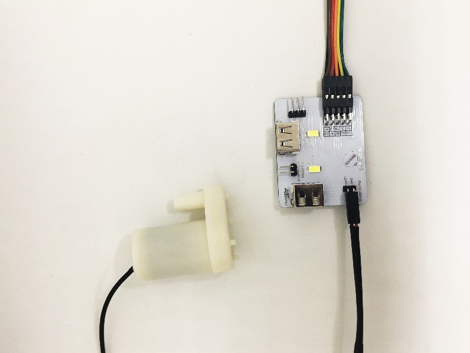
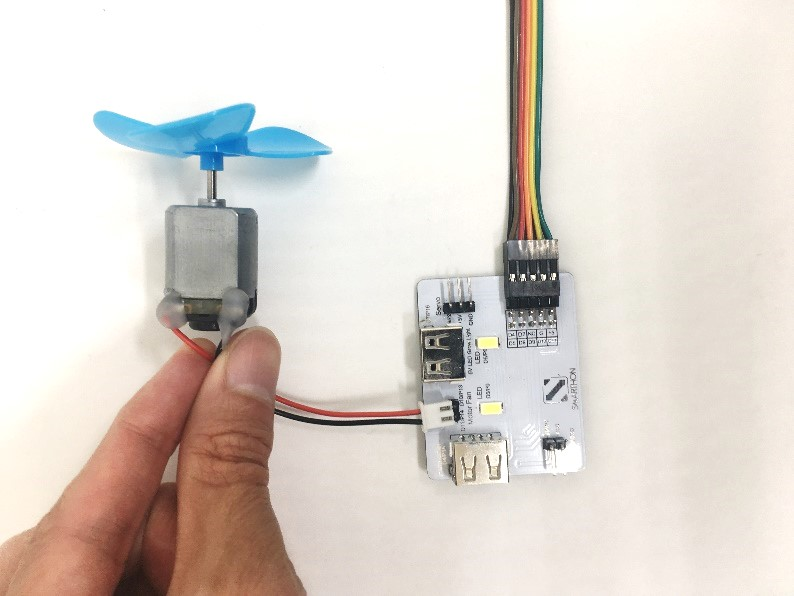

# Hardware User Guide

## Sensors and Multiple Sensors and Plant
Most of the sensors are placed on the board of Multiple Sensors, namely temperature/humidity/air-pressure sensor and digital light sensor. Soil moisture sensor will be shown as a demo.

## Actuators and Multiple Actuators for plant
How to connect the actuator modules and Multiple Actuators for plant?
Please follow the instructions shown below to plug actuator modules into Multiple Actuators correctly to ensure all the modules work effectively.

1.LED grow light

2.Water pump

3.Motor fan

4.Humidifier
