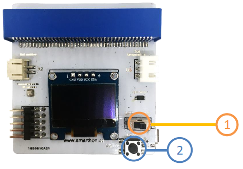

# Reading all the sensors on screen

Part List:

1. Multiple Sensors for plant X1
2. Temperature, Humidity and Air pressure Sensor X1 (placed on the Multiple Sensors)
3. Digital Light Sensor X1 (placed on the Multiple Sensors)
4. Soil humidity sensor X1

You can learn reading sensors and its' interruption which can help you to conduct other projects.

1. Switch on the power button
2. Pressed the button in the right bottom corner of the Multiple Sensors for plant

It shows the temperature, humidity, air Pressure, light as well as soil humidity.

Soil moisture sensor will be shown as an example:
1.Soil Moisture Sensor

When you plug the soil moisture sensor into the port on Multiple Sensors for micro:bit, the screen shows 0.10%; while when you put the soil moisture into the plant with watering, the screen shows around 94%. It indicates that the larger number of the screen shown, the soil moisture level is higher.
Reading the other three sensors:

Temperature:__________________

Humidity:____________________

Digital light sensor:__________________
