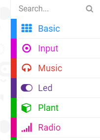
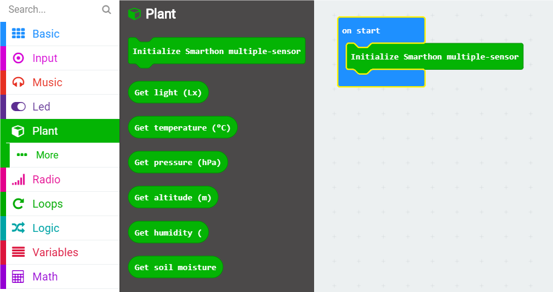

# How to program Smarthon Plant Kit on micro:bit

To Program Smarthon modules with micro:bit, you need to add the Smarthon Plant Kit packages to the BBC micro:bit makecode platform and initialize it first.

Steps:
1.Find the "Extensions" block at the bottom

2.Search “https://github.com/SMARTHON/multiple-sensors-plant”

3.Clicked “multiple sensors” and you can see “Plant” package has been successfully added under “Led”.

4.Initialize Smarthon Plant Kit to add all the functions
