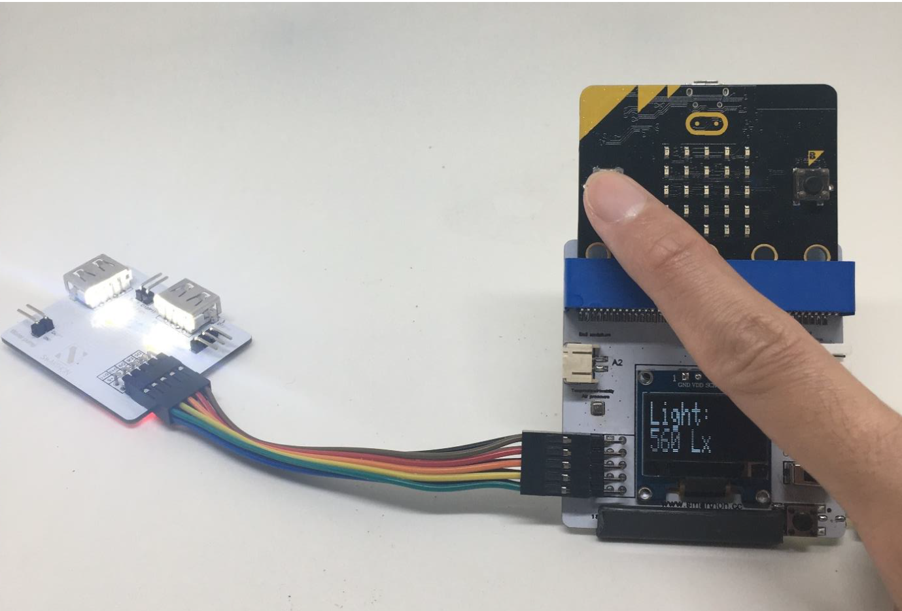

# Project 2:  Control Actuators - button A/B
Level: 

## Part List:

1. LED lights X2 (placed on the Multiple Actuators for plant)
2. Multiple Sensors for plant X1
3. Multiple Actuators for plant X1
4. Connecting wire X1
5. micro:bit X1
6. USB Cable X1

## Description:
In project 2, you can learn how to use micro:bit Button A/B to control LED lights on Multiple Actuators.

## Steps:

1. Basic (Add block on start) > Plant (Add block Initialize Smarthon multiple-sensor)
2. Input (Add block on button A is pressed) > Plant-More (Add block Set LED to intensity 0, change “0” to “1023” )
3. Input (Add block on button A is pressed, change “A” into “B” ) > Plant-More (Add block Set LED to intensity 0)

## Hardware:
4. Connect Multiple Sensors and Multiple Actuators by connecting wire
5. **Download** the code and transfer to micro:bit
6. Plug the micro:bit into Multiple Sensors
7. Pressed micro:bit button A to turn on the LED light; button B to turn off the LED light

*Try to use micro:bit Button A/B to control other outputs – motor fan, humidifier, water pump and LED grow lights