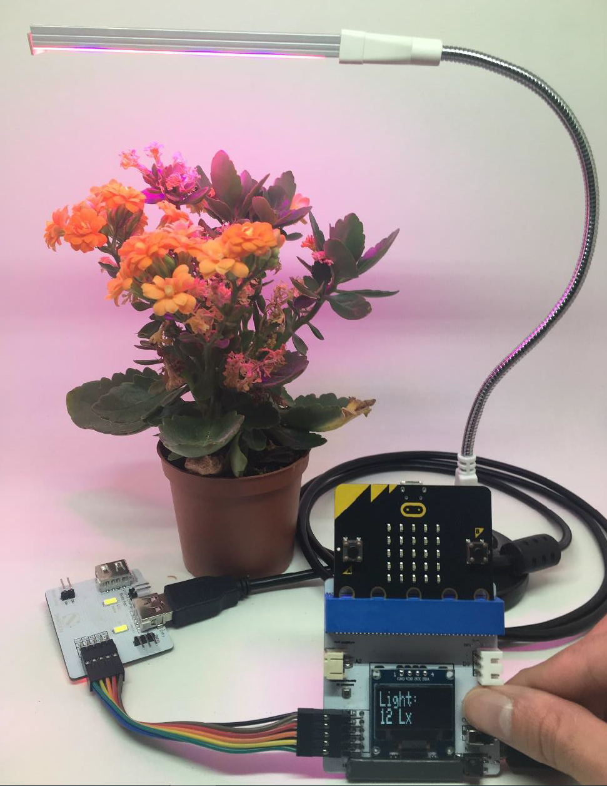

# Project 3:  Smart LED Grow Light
Level: 

## Part List:

1. Digital Light Sensor X1 (placed on Multiple Sensors for plant)
2. LED Grow Light X1
3. USB Base (for LED Grow Light) X1
4. USB Stand (for LED Grow Light) X1
5. Multiple Sensors for plant X1
6. Multiple Actuators for plant X1
7. Connecting Wire X1
8. micro:bit X1
9. USB Cable X1

## Description:
In project 3, you can learn how to control LED grow light by digital light sensor.

## Steps:
1. Basic (Add block on start) > Plant (Add block Initialize Smarthon multiple-sensor)
2. Basic (Add block forever) > Add Logic (Add block if…then…else) > For if : Logic (Add block 0 = 0, change “0” to Plant “Get light (Lx)”; “=” to “>”; “0” to “50”)
3. For then: Plant-More (Add block Set LED grow light to intensity 0, change “0” to “1023”)
4. For else: Plant -More (Add block Set LED grow light to intensity 0)

## Hardware:

1. Connect Multiple Sensors and Multiple Actuators by connecting wire
2. Connect USB Base (for LED Grow Light) to 5V LED Grow Light (D7/P16) port of Multiple Actuators
3. Connect **LED Grow Light** and USB Base by **USB Stand** (for LED Grow Light)
4. Adjust the USB Stand to fit the plant
5. **Download** the code and transfer to micro:bit
6. Plug the micro:bit into Multiple Sensors
7. Try to cover the light sensor by hand to test if the LED Grow Light works properly

## Experiment:
* Do different colours of LED grow lights affect the direction of plant growth?
* Do different colours of LED grow lights affect the rate of photosynthesis?
* Do different types of LED grow lights affect plant growth?
* What is the difference between sunlight and LED grow light among the plant growth?
