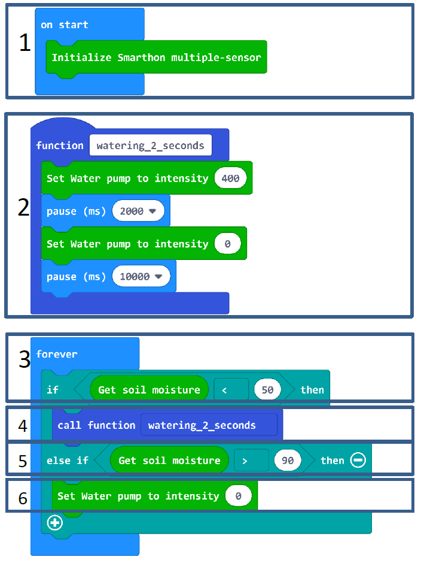

# Project 4:  Automatic Irrigation (watering)
Level: 

## Part List:
1. Soil Moisture Sensor
2. Water Pump & Pipe X1
3. Multiple Sensors for plant X1
4. Multiple Actuators for plant X1
5. Connecting Wire X1
6. micro:bit X1
7. USB Cable X1
8. A glass of water X1

## Description:
In project 4, you can learn how to watering the plant automatically by soil moisture detector.

## Steps:
1. Basic (Add block on start) > Plant (Add block Initialize Smarthon multiple-sensor)
2. Functions (Make a Function > New function name: ) > watering_2_seconds) > Plant-More (Add block Set Motor pump to intensity 0, change “0” to “400”) > Basic (Add block pause (ms) 100, change “100” to “2000”) > > Plant-More (Add block Set Motor pump to intensity 0) > Basic (Add block pause (ms) 100, change “100” to “10000”)
3. Basic (Add block forever) > Logic (Add block if…then…else, add 1 more if…then…else, delete else) > For 1st if : Logic (Add block 0 = 0, change “0” to Plant “Get soil moisture”; “=” to “<”; “0” to “50” )
4. For then: Advanced>Functions (Add block call function watering_2_seconds)
5. For else if: Logic (Add block 0 = 0, change “0” to Plant “Get soil moisture”; “=” to “>”; “0” to “90” )
6. For then: Plant-More (Add block Set Water pump to intensity 0)

## Hardware:
7. Connect Multiple Sensors and Multiple Actuators by connecting wire
8. Connect Water Pump and Pipe
9. Connect Water Pump & Pipe to Water pump (D6/P1) port of Multiple Actuators
10. **Download** the code and transfer to micro:bit
11. Plug the micro:bit into Multiple Sensors

## Experiment:
* How does soil moisture level affect seed germination?
* Does soil moisture level affect the size of leave?
* Does soil moisture level affect photosynthesis or respiration of the plant?
* Does soil moisture level affect root growth?
* Does water salinity affect plant growth?