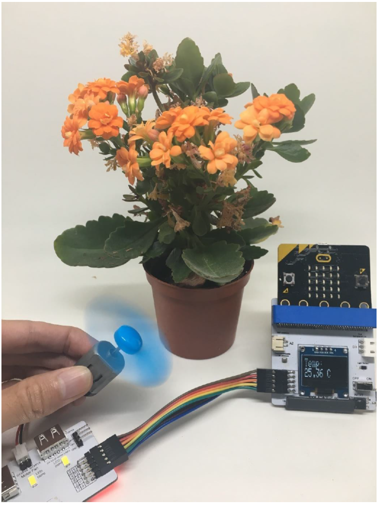

# Project 5:  Smart Environment (temperature control)
Level: 

## Part List:

1. Temperature Sensor X1 (placed on Multiple Sensors for plant)
2. Motor Fan X1
3. Multiple Sensors for plant X1
4. Multiple Actuators for plant X1
5. Connecting Wire X1
6. micro:bit X1
7. USB Cable X1

## Description:
In project 5, you can learn how to make a fan automation that allows you to control the ambient temperature.

## Steps:
1. Basic (Add block on start) > Plant (Add block Initialize Smarthon multiple-sensor)
2. Basic (Add block forever) > Logic (Add block if…then…else, add 1 more if…then…else) > For 1st if : Logic (Add block “ ” and “ ”, 1st “ ” : Add block 0 = 0, change “0” to Plant “Get temperature(°C)”; “=” to “>”; “0” to “27” ; 2nd “ ” : Add block 0 = 0, change “0” to Plant “Get temperature(°C)”; “=” to “<”; “0” to “32”)
3. For then: Plant-More (Add block Set Motor fan clockwisely to intensity 0, change “0” to “500” )
4. For else if: Logic (Add block 0 = 0, change “0” to Plant “Get temperature(°C)”; “=” to “>”; “0” to “32” ) > For then: Plant-More (Add block Set Motor fan clockwisely to intensity 0, change “0” to “1023” )
5. For else: Plant-More (Add block Set Motor fan clockwisely to intensity 0)

## Hardware:

6. Connect Multiple Sensors and Multiple Actuators by connecting wire
7. Connect Motor fan to Motor Fan (D11/P14; D10/P13) port of Multiple Actuators
8. **Download** the code and transfer to micro:bit
9. Plug the micro:bit into Multiple Sensors

## Experiment:
* How does temperature affect plant growth?
* Does temperature affect seed growth?
* Does motor fan affect plant transpiration rates?